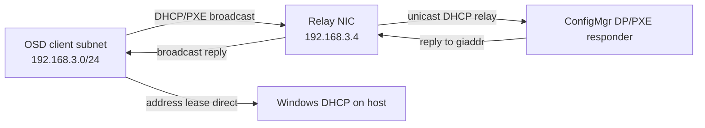

# DHCP Relay for OSD: Implementation and Handoff Plan

Status: implemented in code; disposable-lab live PXE acceptance remains required before support is claimed.

Date: 2026-09-04

## Implementation status

The model, GenConfig workflow, image prerequisites, MAC-bound network
reconciliation, dnsmasq service, lifecycle hooks, Phase 8 targeting, boundary
generation, preflight checks, and Phase 11 readiness validation are implemented.
Focused resolver, GenConfig, and mocked reconciler tests run under PowerShell 7
and Windows PowerShell 5.1. Shell syntax is gated with `bash -n`.

The image/runtime compatibility contract is intentionally bidirectional:

- current code can use an older Main/Dev Server image; the relay and Proxy
  installers detect missing packages and retain their runtime apt fallback;
- a newly baked Server image can be used by Main, Dev, or this branch because
  it contains only generic packages, leaves Squid and dnsmasq disabled, does not
  enable UFW, and carries no relay topology or per-lab configuration;
- older Proxy installers may repeat an idempotent apt transaction against the
  new image, but remain functional;
- Desktop images do not receive the Server-only relay/Proxy package set.

This status does **not** establish that ConfigMgr's non-WDS PXE responder has
completed a relayed exchange. The packet-capture acceptance gate below is still
mandatory, and messages intentionally say “relay configuration is ready” rather
than “PXE relay works.”

## Handoff context

This document is intended to be passed to another coding session. The feature
adds an optional Linux DHCP relay for ConfigMgr PXE when an OSD client does not
share a subnet with a Distribution Point (DP).

At handoff, the checkout is on `feature/wsus-prefix` and has unrelated work that
must not be reverted:

- `vmbuild/common/Common.GenConfig.Summary.ps1` has an uncommitted fix for an
  OSDClient summary trailing comma.
- `vmbuild/docs/GenConfig/README.md` is pre-existing untracked documentation.

Recheck `git status` before editing because another session may have advanced
the tree.

## User requirements

1. Keep Windows DHCP on the Hyper-V host.
2. Do not reintroduce RRAS. A prior RRAS update broke host RDP and required
   Azure serial-console recovery.
3. Use a dedicated Ubuntu relay VM rather than privileged packet-filter code on
   the management host.
4. A same-subnet DP is preferred. Relay is optional and is offered only when no
   usable DP exists on the selected OSD subnet.
5. The menu must offer either adding/enabling a local DP or relaying to an
   existing remote DP.
6. Extra relay NICs must not be described by cloud-init. They are hot-added and
   configured after first boot.
7. A later domain expansion must add newly required relay NICs and mappings to
   the existing relay without rebuilding it.
8. Each relay-facing subnet uses the stable address `x.x.x.4/24`.
9. Rebake the Ubuntu Server image with safe, generic prerequisites to reduce
   deployment time.
10. Phase 8/perfloading, boundary creation, preflight validation, and Phase 11
    must all understand the same resolved PXE topology.

## Non-goals and safety boundaries

- Do not change or remove `Test-NoRRAS`.
- Do not install routing roles on the Windows host.
- Do not change host management adapters, default routes, WinNAT, or RDP
  networking.
- Do not set DHCP options 60, 66, or 67.
- Do not turn the relay VM into an IP router. Keep
  `net.ipv4.ip_forward = 0`; this is an application-level DHCP relay.
- Do not relay DHCP requests to the host DHCP service. The host is directly
  attached to every internal switch and already receives client broadcasts.
  Relay only to the selected ConfigMgr PXE responder.
- Do not automatically remove a relay NIC in the first release. Stop relaying
  on stale mappings and report the extra NIC; removal is a later, separately
  proven operation.
- Do not claim relay support from configuration checks alone. A full live PXE
  exchange is the release gate.

## Existing topology

- Every lab `/24` has a Hyper-V internal switch named for the subnet.
- The host owns `x.x.x.200`, enables per-interface forwarding, and provides
  WinNAT.
- Windows DHCP runs on the host with a scope from `.20` through `.199`.
- Well-known role addresses currently include:
  - `.1`: DC
  - `.2`: Proxy
  - `.3`: BDC
  - `.5`: CAS
  - `.10`: Primary
  - `.15`: Secondary
  - `.200`: host gateway
- `.201` through `.254` are used for SQL AO virtual IP allocation.
- `.4` is outside the DHCP pool and is the proposed relay address on every
  attached subnet.
- ConfigMgr uses the non-WDS PXE responder on a DP.

## Proposed topology

Initial scope: at most one `DHCPRelay` VM per domain.

The relay has:

- one management NIC created with the VM on the domain default network;
- management address `default-subnet.4/24`;
- the only default route, through `default-subnet.200`;
- DNS only on the management link;
- one hot-added NIC for each relayed OSD client subnet that is not already the
  management subnet;
- `client-subnet.4/24` on each relay NIC, with no gateway, DNS, or default
  route.

The selected remote DP is reached through the management route and host
forwarding. The relay does not need a NIC on each DP subnet.



The packet flow above is the intended design, not yet a measured result.

## Address rules

`DHCPRelay` becomes a fixed-address role in `Set-DeployConfigIPAddresses`:

```text
DHCPRelay -> x.x.x.4
```

Every hot-added relay NIC also receives `.4` on its own `/24`. Because `.4` is
outside `.20-.199`, do not create a DHCP reservation or exclusion for it.

Before assigning `.4`, fail closed if any of these indicate another owner:

- DHCP reservation or lease;
- a live Hyper-V adapter reporting the address through KVP;
- ARP/neighbor entry confirmed by a probe;
- another configured MemLabs role or relay mapping;
- an existing adapter on the relay with the same IP attached to a different
  switch.

An unvalidated ping timeout is not proof that `.4` is free. The configuration
and live-owner checks are authoritative; a successful response is an
additional conflict signal.

## Authored configuration

The authored config stores user intent on the relay VM. It does not store MAC
addresses, relay IPs, target IPs, or derived site codes.

```json
{
  "vmName": "ADA-RELAY1",
  "role": "DHCPRelay",
  "operatingSystem": "Ubuntu Server 24.04 LTS",
  "osFamily": "Linux",
  "memory": "2GB",
  "virtualProcs": 2,
  "network": "192.168.1.0",
  "relayMappings": [
    {
      "clientNetwork": "192.168.3.0",
      "distributionPointVM": "ADA-DP1"
    }
  ]
}
```

Rules:

- `clientNetwork` is unique across all relay mappings in the domain.
- `distributionPointVM` names a VM that is, or will become, a ConfigMgr DP.
- The target DP may be a Primary, Secondary, SiteSystem, or pull DP.
- The target DP must have a site code and a resolvable stable IP.
- Multiple OSD clients on one subnet share one mapping.
- A same-subnet DP always overrides a stored relay mapping. The mapping becomes
  dormant and is reported as stale; it is not used or deleted automatically.
- A mapping whose relay VM or target DP is missing is invalid, not partial
  coverage.

For add-to-existing workflows, persist `relayMappings` with the relay VM note
using the same hidden existing-VM update model used by other GenConfig edits.

## Derived PXE path model

Add one shared pure resolver in
`vmbuild/common/Common.Config.ps1`, tentatively named `Get-OsdPxePaths`.

It returns one or more rows per distinct OSD client subnet:

```json
{
  "clientNetwork": "192.168.3.0",
  "mode": "Relay",
  "relayVM": "ADA-RELAY1",
  "relayIPv4": "192.168.3.4",
  "distributionPointVM": "ADA-DP1",
  "distributionPointNetwork": "192.168.1.0",
  "distributionPointSiteCode": "PS1"
}
```

Allowed modes:

- `Direct`: one or more same-subnet DPs exist. Preserve current behavior by
  returning every eligible same-subnet DP.
- `Relay`: no direct DP exists and exactly one valid relay mapping supplies a
  target DP.
- `Missing`: neither a direct path nor a complete relay path exists.
- `Invalid`: conflicting mappings, missing objects, a non-DP target, missing
  site ownership, or another structural error.

Resolution precedence is `Direct`, then `Relay`, then `Missing`. Structural
conflicts are `Invalid` even if another row appears usable.

Generate and serialize the result as top-level `deployConfig.osdPxePaths` after
existing VM metadata has been merged. Host-side consumers may call the same
resolver before serialization; guest-side Phase 8 consumes the serialized
rows. No consumer should reconstruct subnet equality independently.

The resolver must support:

- new and hidden existing VM shapes;
- `network`, `thisParams.vmNetwork`, and deployed-network fallback through
  `Get-OsdEffectiveNetwork`;
- existing DPs discovered through `Get-List2`;
- duplicate OSD clients on one subnet;
- multiple direct DPs on one subnet;
- direct-DP precedence over a stale relay mapping;
- DP site ownership needed for boundary creation.

## GenConfig behavior

The current decision loop is in
`vmbuild/common/Common.GenConfig.AddVM.ps1`:

- `Select-OsdClientNetwork`
- `Add-DistributionPointForOsdNetwork`

Refactor the remediation menu without changing the fast path.

### Fast paths

1. If the selected subnet already has a usable DP, accept it immediately and
   do not show a relay prompt.
2. If it has a valid stored relay path, accept it immediately and show the
   path in the VM/config summary.
3. In a lab with no ConfigMgr site, retain the current behavior and accept the
   OSDClient subnet without DP/relay remediation.

### Missing-path menu

When the subnet has neither a local DP nor a valid relay path, show:

```text
OSD requires a PXE path on 192.168.3.0

  [D] Install or enable a Distribution Point on this subnet
  [R] Relay PXE to an existing Distribution Point
  [B] Choose a different subnet
```

Hide or disable `R` when no valid remote DP candidate exists.

### Direct DP branch

Retain the existing choices:

- promote a suitable VM on the subnet;
- add a DP-only SiteSystem VM;
- choose the owning site while respecting subnet/site ownership locks.

### Relay branch

1. List remote DPs with VM name, site code, subnet, and DP type.
2. Exclude DPs on the selected client subnet because those are direct.
3. Let the user select a target DP.
4. Reuse the domain's existing `DHCPRelay` VM, or offer to create one when
   absent.
5. Add or replace the mapping transactionally.
6. Persist an existing relay VM as a hidden modified object immediately.
7. Re-resolve the path and accept the subnet only if it now resolves to
   `Relay`.

Cancellation must leave the original VM and relay mappings unchanged.

## Linux image rebake

No relay topology belongs in the image. The rebake should contain only inert,
generic prerequisites.

Update `vmbuild/scripts/linux/bake/02-base-packages.sh` for the Server image:

```text
dnsmasq-base
tcpdump
squid
ufw
python3-flask
```

Rationale:

- `dnsmasq-base` provides the relay-capable binary without enabling the
  distro `dnsmasq` service.
- `tcpdump` supports the required live acceptance capture and later
  diagnostics.
- `squid`, `ufw`, and `python3-flask` eliminate the Proxy role's remaining
  large runtime apt transaction.

Bake requirements:

1. Stop and disable `squid.service` after package installation. Do not mask it;
   the Proxy installer must be able to enable it later.
2. Confirm no dnsmasq service is enabled or listening on UDP 67.
3. Do not enable UFW as part of the bake. Preserve the current policy; runtime
   code may add rules if UFW is already active.
4. Extend `validate-server.sh` to verify all packages are installed and that
   Squid/dnsmasq are not active listeners in the generic image.
5. Extend `validate-desktop.sh` only if the common package step also runs for
   Desktop and those packages are intentionally retained there. Prefer a
   Server-only relay/proxy package step if avoiding Desktop image bloat matters.
6. Update the bake step count and labels in `Invoke-LinuxBaseImageBake` if a new
   script is added rather than extending step 02.

Update `vmbuild/scripts/linux/proxy/install-squid.sh` so a baked but inactive
Squid installation skips `apt-get update` and package installation, writes the
runtime configuration, then enables and starts the service.

Add bake controls proving the optimization is real:

- Before rebake, run the Proxy installer against an old image and record that
  package installation is required.
- After rebake, assert the installer emits its package-present path and makes
  zero apt invocations.
- Do not infer the speedup only from package presence.

## Post-cloud-init network ownership

Extra NICs must never appear in NoCloud `network-config`.

The current seed writes a broad `match: name: "e*"` primary profile, and the
DC-DNS helper writes another broad match. A new NIC would be claimed by those
profiles unless management networking is narrowed first.

### New or existing relay preparation

After cloud-init reports a terminal state and before the first hot-add:

1. Resolve the relay's current management adapter on the host by switch and
   MAC.
2. Resolve the corresponding guest interface over SSH and verify it owns the
   expected management IP.
3. Write a replacement netplan management profile matched by normalized MAC.
4. Preserve its current static `.4/24`, default route, and DNS.
5. Write `/etc/cloud/cloud.cfg.d/99-disable-network-config.cfg` containing:

   ```yaml
   network:
     config: disabled
   ```

6. Remove or neutralize only the generated broad `50-cloud-init.yaml` after the
   replacement has passed `netplan generate`.
7. Change `scripts/linux/lib/set-dc-dns.sh` to merge DNS into the existing
   `primary` netplan ID without adding its own `e*` match. Update the seed's
   frozen helper for new VMs too.
8. Reboot the relay once.
9. Prove SSH reconnects at the management address, exactly one default route
   exists, and the management MAC owns that route.
10. Persist a version marker such as
    `/var/lib/memlabs/relay-network-schema` so reruns skip the migration only
    after validating the live state.

If any proof fails, stop before adding a NIC. Do not attempt a second adapter
while management ownership is ambiguous.

### Hot-add reconciliation

Add an idempotent host-side function in `Common.Linux.ps1`, tentatively
`Sync-LinuxDhcpRelay`, that treats configured mappings as desired state.

For each active `Relay` path:

1. Confirm the subnet switch and host DHCP scope exist.
2. Confirm `.4` is available using the address rules above.
3. Find a relay adapter already attached to that exact switch.
4. If absent, hot-add one with a stable host-visible name such as
   `DHCPRelay-192.168.3.0` and capture its MAC from Hyper-V.
5. Wait for the guest to enumerate that MAC.
6. Write one atomic netplan fragment matched by MAC with
   `192.168.3.4/24`, `dhcp4: false`, and no routes or nameservers.
7. Run `netplan generate`, then `netplan apply`.
8. Read back the guest address, route table, and interface MAC.
9. Fail if another default route appeared or management SSH stopped working.

The adapter identity is `{relay VM, client network, Hyper-V switch, MAC}`.
Never use Linux enumeration order (`eth1`, `ens4`, and similar) as identity.

On rerun:

- matching switch and MAC with correct guest IP is a no-op;
- missing adapter is added;
- wrong guest IP is corrected by MAC;
- duplicate adapters on one client switch are a failure;
- unexpected/stale adapters are reported and excluded from dnsmasq config, but
  not removed.

## Relay service

Add a runtime shell module under `vmbuild/scripts/linux/`, for example
`relay/configure-dhcp-relay.sh`, and invoke it through
`Invoke-LinuxVmCommand -Sudo`.

Use the baked `dnsmasq-base` executable in relay-only mode. Do not configure
DNS, DHCP address allocation, TFTP, or proxy-DHCP options on this VM.

Generate one relay declaration per active path using:

- local address: `client-subnet.4`;
- server address: the stable IPv4 of `distributionPointVM`;
- server-facing interface/address restriction only when routing proves it is
  valid for every target.

Resolve target DP IP in this order:

1. `AssignedIP` in deploy config;
2. VM note `AssignedIP`;
3. DHCP reservation for the DP's primary MAC;
4. Hyper-V KVP IPv4 on the DP's domain switch.

Fail when these sources disagree. Do not silently choose the first conflicting
instrument.

Runtime configuration requirements:

- atomically write the generated configuration;
- validate it before restart with `dnsmasq --test`;
- run under a dedicated systemd unit, not the distro DNS service;
- restart only when content changes;
- enable and start only after every expected NIC/IP is proven;
- bind/listen only as required for the mapped lab interfaces;
- keep IP forwarding disabled;
- retain useful journald logs;
- add UDP 67/68 firewall rules only if UFW is already active;
- stop the service when zero active relay paths remain.

The exact dnsmasq relay syntax and reply path must be validated against the
version baked into Ubuntu 24.04. Do not copy an ISC `dhcrelay` command line.

## Lifecycle and domain expansion

The relay must reconcile even when it is an existing hidden VM.

### Deploy-config inclusion

When an OSD config contains any relay mapping:

- include the relay VM in deploy config;
- include every target DP;
- include each target DP's owning Primary required to run Phase 8;
- mark the relay and target DPs for Phase 11 OSD validation;
- retain metadata-only handling where a hidden DP must inform Phase 8 without
  receiving unrelated DSC work.

Update `Add-ExistingVMsToDeployConfig` and `Get-Phase8ConfigurationData` rather
than depending on the relay being a newly created VM.

### Reconciliation timing

Run reconciliation:

1. after Phase 3 in a normal deployment, once Linux cloud-init and role setup
   are complete;
2. again as an idempotent Phase 8 precondition, so `-StartPhase 8` repairs a
   changed mapping on an existing relay before ConfigMgr content targeting;
3. from a dedicated repair command for diagnostics and manual recovery.

Do not run Phase 8 when a requested relay path cannot be reconciled. The
failure must identify the client subnet, relay VM, target DP, and failed proof.

For expansion, GenConfig edits the existing relay's `relayMappings`, deploy
conversion pulls that relay in as hidden, and the Phase 8 precondition hot-adds
only the newly missing NIC. No rebuild and no cloud-init regeneration occur.

## Phase 8 and perfloading

The current OSD block in `vmbuild/DSC/phases/perfloading.ps1` derives OSD DPs by
checking whether a DP subnet equals an OSDClient subnet. Replace that local
derivation with `deployConfig.osdPxePaths`.

Phase 8 must:

1. Reject `Missing` and `Invalid` paths with precise diagnostics.
2. Resolve the unique target DP set from both `Direct` and `Relay` rows.
3. Confirm every expected target exists in live
   `Get-CMDistributionPoint -AllSite` output.
4. Add those target DPs to `OSD DPS`.
5. Verify group membership against the expected target set.
6. Enable the non-WDS PXE responder on every target DP.
7. Distribute boot images, OS images, OS upgrade packages, and USMT to the same
   target set.
8. Log each path explicitly, for example:

   ```text
   OSD PXE path: 192.168.3.0 -> ADA-RELAY1 -> ADA-DP1 (PS1)
   ```

9. Preserve the no-OSDClient behavior: create OSD objects but distribute no OSD
   content.

Rename messages and the `OSD DPS` description so they say "DPs serving OSD
clients" rather than "DPs on an OSDClient subnet".

## Boundary generation

Refactor `Get-OsdBoundaryMappings` to consume resolved PXE paths:

- `Direct`: map the client subnet to the direct DP's site code.
- `Relay`: map the client subnet to the selected target DP's site code.
- `Missing` or `Invalid`: create no fabricated mapping and report validation
  failure.

Retain existing conflict detection when another site already owns the subnet.
A relay does not override ConfigMgr boundary ownership.

## Pre-deploy validation

Replace the same-subnet-only OSD check in
`vmbuild/common/Common.Validation.ps1` with resolver-based validation.

Accept:

- at least one complete `Direct` row; or
- exactly one complete `Relay` row for the subnet.

Reject:

- no PXE path;
- multiple relay owners for a subnet;
- relay VM missing or not Linux;
- target missing, not a DP, or lacking a site code;
- target IP unresolved or conflicting;
- client network equal to target network in a relay mapping (it should be
  direct instead);
- `.4` conflict;
- more desired adapters than Hyper-V/guest policy permits;
- relay mapping attached to a lab with no corresponding OSD client, as a
  warning only.

Do not downgrade structural invalidity to a warning merely because Phase 8 can
continue creating unrelated objects.

## Phase 11 validation

Phase 11 has three existing same-subnet assumptions and needs one new relay
check.

### 1. DP-local OSD decision

In `Test-VmFunctionality`, calculate `dpServesOsd` from the resolved target DP
set, not from subnet equality. A remote relay target must run the same local DP
checks as a direct target:

- `SMS_DP$` and content library;
- PXE responder state;
- `IsActive=1`;
- `SupportUnknownMachines=1`;
- boot-image content and extracted `SMSBoot` payload;
- local responder logs when validation fails.

### 2. Site-wide expected DP membership

In `Test-CMSiteFunctionality`, derive `expectedOsdDpCsv` and uncovered paths
from `osdPxePaths`. Compare actual `OSD DPS` membership against the unique
expected target set. Do not let the group's own membership testify that it is
complete.

All existing boot-image, OS-package, USMT, and distribution-state checks must
use the same expected targets.

### 3. Boundary validation

The existing Phase 11 boundary-pair check must expect each relayed OSD subnet
inside the selected target DP site's boundary group.

### 4. Relay-specific validation

Add a Linux relay validator that checks independently from the generated file:

- Hyper-V has exactly one adapter on each expected client switch;
- host adapter MAC equals the guest interface MAC;
- each expected interface owns exactly `subnet.4/24`;
- no unexpected default routes exist;
- management SSH still uses the management interface;
- cloud-init network regeneration is disabled after migration;
- no broad `e*` netplan matcher remains before extra NICs are accepted;
- `net.ipv4.ip_forward` is `0`;
- `dnsmasq --test` succeeds;
- relay systemd unit is enabled and active;
- UDP 67 is listening;
- each expected `{client subnet, target DP IP}` mapping appears exactly once;
- stale mappings/NICs are reported;
- journald contains no startup or bind failure.

Configuration validation proves readiness, not successful packet traversal.
Use wording such as "relay configuration is ready" rather than "PXE relay
works" until the live acceptance test passes.

## Shared resolver tests

Create a focused dual-engine test for `Get-OsdPxePaths` covering:

1. no OSD clients;
2. no ConfigMgr site;
3. one direct DP;
4. multiple direct DPs;
5. valid relay mapping;
6. direct DP overriding a stored relay mapping;
7. missing relay VM;
8. missing target DP;
9. target without DP capability;
10. target without site ownership;
11. duplicate relay mappings for one subnet;
12. multiple OSD clients deduplicated by subnet;
13. hidden existing relay and DP metadata;
14. target IP source agreement and disagreement;
15. boundary mapping for direct and relay modes.

Run under PowerShell 7 and Windows PowerShell 5.1.

## GenConfig tests

Extend `vmbuild/tools/Test-GenConfigNetworkSelection.ps1` to prove:

- local DP takes the fast path without showing remediation;
- valid relay takes the fast path;
- missing path offers DP and relay choices;
- relay option is absent with no remote DP;
- selecting DP preserves current behavior;
- selecting relay creates a relay VM when absent;
- selecting relay updates an existing relay transactionally;
- cancel restores the old mapping;
- direct DP later overrides relay without deleting it;
- add-to-existing persists one hidden relay snapshot rather than duplicates;
- no-ConfigMgr labs remain unchanged.

## NIC reconciler tests

Use mocked Hyper-V and SSH boundaries to prove:

- management handoff is completed before `Add-VMNetworkAdapter` is reachable;
- a matching NIC is a no-op;
- a missing NIC is added once;
- rerun does not add another NIC;
- guest config is keyed by MAC, never enumeration order;
- duplicate switch adapters fail;
- `.4` conflict fails before mutation;
- wrong switch/MAC/IP fails with diagnostics;
- netplan generation failure prevents apply/service restart;
- management SSH failure aborts further mappings;
- stale NICs are reported but not removed;
- zero active mappings stops the relay service.

## Bake and shell tests

- `bash -n` every new or changed shell script.
- Run ShellCheck when available, but do not make a new required dependency
  without repository agreement.
- Extend bake validation to inspect package and service state.
- On an Ubuntu 24.04 VM, run `dnsmasq --test` against generated direct and
  multi-mapping configurations.
- Prove the baked Proxy installer performs no apt transaction.

## PowerShell gates

For each touched PowerShell file:

- parse with both available engines;
- run `vmbuild/DSC/Test-PS51Patterns.ps1`;
- run focused tests in PowerShell 7 and 5.1;
- compare PSScriptAnalyzer finding identity against a byte-exact baseline with
  the original `.ps1` extension;
- run `Test-OrphanGlobals.ps1`;
- run `Test-MandatoryParamCalls.ps1`;
- run `Test-BarewordAssignment.ps1`;
- run `Test-UndeclaredParamCalls.ps1`;
- run `git diff --check`.

Do not use `git show ... | Set-Content` for analyzer baselines; preserve exact
bytes and the source extension.

## Live acceptance gate

Do not relax supported same-subnet behavior until this passes on a disposable
lab.

Required topology:

- subnet A: OSD client and relay `.4`, no DP;
- subnet B: selected ConfigMgr DP with non-WDS PXE responder;
- Windows DHCP remains on the host;
- DHCP options 60/66/67 absent;
- no RRAS.

Capture simultaneously on relay client and management links. Prove:

1. Client DHCPDISCOVER is seen on subnet A.
2. Host DHCP supplies the address lease directly.
3. Relay forwards the PXE DHCP exchange to only the selected DP.
4. Forwarded packet has the expected `giaddr` of subnet A `.4`.
5. DP response returns to `.4` and is broadcast to the client.
6. Client receives the correct architecture-specific boot offer.
7. TFTP/boot payload is downloaded from the selected DP.
8. WinPE starts.
9. Task sequence policy is received through the boundary mapped to the target
   DP's site.
10. OS image and dependent content are found on the same required target set.
11. Host RDP remains reachable throughout.
12. Rebooting the relay restores all mappings without cloud-init changes.
13. Adding a second OSD subnet hot-adds one NIC and both subnets still boot.

Archive the pcaps and relevant `SMSPXE.log`, relay journal, Phase 8 log, and
Phase 11 output. A successful lease alone is not a PXE proof.

## Suggested implementation slices

Keep each slice independently testable.

### Slice 1: Model and pure resolver

- Add `DHCPRelay` role defaults and schema.
- Add `relayMappings` normalization.
- Implement `Get-OsdPxePaths` and tests.
- Refactor boundary mapping to use the resolver.
- Do not change runtime DP coverage yet.

### Slice 2: GenConfig workflow

- Add DP-or-relay remediation menu.
- Add remote DP selector.
- Add transactional existing-relay persistence.
- Extend the existing network-selection test suite.

### Slice 3: Rebake speedups

- Bake relay and Proxy prerequisites.
- Keep generic services inactive.
- Add package-present Proxy fast path.
- Validate old-image fallback and new-image no-apt paths.

### Slice 4: Network and relay reconciliation

- Implement management netplan migration.
- Implement MAC-bound hot-add reconciliation.
- Implement dnsmasq config/service module.
- Add mocked reconciler tests and a manual repair entrypoint.

### Slice 5: Lifecycle and expansion

- Pull existing relay/targets/owner Primaries into deploy config.
- Add post-Phase-3 and pre-Phase-8 reconciliation.
- Verify add-to-existing and `-StartPhase 8` behavior.

### Slice 6: Phase 8 and Phase 11

- Consume `osdPxePaths` in perfloading.
- Update `OSD DPS`, content targeting, PXE enablement, and messages.
- Update preflight, DP-local, site-wide, boundary, and relay validation.

### Slice 7: Live proof and release

- Run the two-subnet acceptance test.
- Fix only evidence-backed incompatibilities.
- Retain same-subnet-only support if the full exchange is not proven.
- After proof, document relay as supported and retain direct-DP precedence.

## Primary files likely to change

- `vmbuild/common/Common.GenConfig.AddVM.ps1`
- `vmbuild/common/Common.GenConfig.Existing.ps1`
- `vmbuild/common/Common.GenConfig.RoleMenus.ps1`
- `vmbuild/common/Common.GenConfig.VMList.ps1`
- `vmbuild/common/Common.GenConfig.Help.ps1`
- `vmbuild/common/Common.Config.ps1`
- `vmbuild/common/Common.GenConfig.ps1`
- `vmbuild/common/Common.Validation.ps1`
- `vmbuild/common/Common.Validation.Functional.ps1`
- `vmbuild/common/Common.Linux.ps1`
- `vmbuild/common/Common.Phases.ps1`
- `vmbuild/common/Common.ScriptBlocks.ps1` if a dedicated job wrapper is used
- `vmbuild/DSC/phases/perfloading.ps1`
- `vmbuild/scripts/linux/lib/set-dc-dns.sh`
- `vmbuild/scripts/linux/bake/02-base-packages.sh`
- `vmbuild/scripts/linux/bake/validate-server.sh`
- `vmbuild/scripts/linux/proxy/install-squid.sh`
- new relay shell module(s) under `vmbuild/scripts/linux/`
- `vmbuild/tools/Test-GenConfigNetworkSelection.ps1`
- new focused resolver and reconciler tests under `vmbuild/tools/`

This list is a routing guide, not permission to edit every file. Follow the
controlling path and keep each slice narrow.

## Questions to settle with evidence

1. Confirm Ubuntu 24.04's packaged dnsmasq version and exact multi-relay syntax.
2. Confirm ConfigMgr's non-WDS PXE responder accepts relayed requests and sends
   replies correctly to `giaddr` without DHCP options 60/66/67.
3. Confirm whether dnsmasq's server-facing interface restriction works for all
   target-DP route combinations; omit it if it rejects legitimate replies.
4. Measure whether one dnsmasq process can serve all mappings reliably or
   whether one systemd instance per mapping gives better isolation.
5. Establish a practical adapter-count guard below Hyper-V's platform maximum
   if large labs approach it.
6. Decide, after observing stale mappings in real expansions, whether automated
   NIC removal is worth a separate feature.

## Definition of done

The feature is complete only when:

- the GenConfig menu offers relay only when needed;
- direct DP always wins;
- authored mappings survive save, reload, deploy, and domain expansion;
- image validation proves prerequisites are baked and inert;
- runtime reconciliation is idempotent and preserves management access;
- Phase 8 targets the selected remote DPs and creates correct boundaries;
- Phase 11 validates target DPs and relay state from the same derived model;
- dual-engine and repository gates pass;
- a captured end-to-end PXE boot through the relay passes every live acceptance
  criterion;
- RRAS and host management networking remain untouched.

## Suggested prompt for the next session

```text
Read vmbuild/docs/DHCP-Relay-OSD-Implementation-Plan.md and implement Slice 1
(model and pure resolver) only. Treat the document's live PXE acceptance test as
a release gate, preserve direct-DP precedence, do not touch RRAS or host
management networking, and do not revert unrelated working-tree changes. Run
the focused tests under PowerShell 7 and Windows PowerShell 5.1 before widening
scope.
```