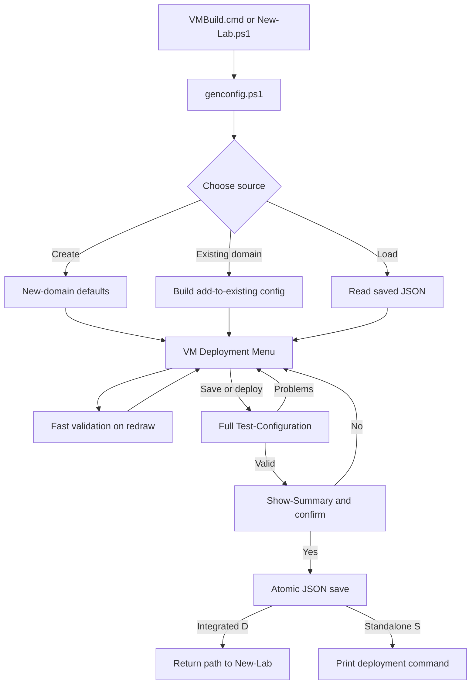

# GenConfig UI

## Purpose and when to use GenConfig

GenConfig is the interactive configuration editor for MemLabs. It builds and
edits the JSON consumed by `New-Lab.ps1`; it does not create VMs by itself unless
it was launched from `New-Lab.ps1` and the operator chooses **Deploy And Save
Config**.

Use GenConfig to:

- create a new Active Directory domain with or without ConfigMgr;
- extend an existing MemLabs domain with VMs, sites, or site-system roles;
- select supported operating systems, ConfigMgr and SQL versions from the
  current media manifest;
- configure ConfigMgr hierarchy, SQL, SUP, PKI, HTTPS, BitLocker Management,
  client push, HA, OSD task-sequence targeting, direct or relayed PXE, and
  specialized lab roles;
- inspect and operate existing MemLabs VMs, networks, snapshots, disks, tools,
  dynamic memory, and connection-file settings;
- validate, summarize, save, and optionally deploy a configuration.

The controlling entry points are `Select-ConfigMenu`, `Select-MainMenu`, and
`Save-Config` in [genconfig.ps1](../../genconfig.ps1). Configuration validation
is owned by `Test-Configuration` in
[Common.Validation.ps1](../../common/Common.Validation.ps1), not by the labels
shown in the UI.

## Quick start

### Prerequisites

- Run on the intended Hyper-V host from an elevated session. `New-Lab.ps1`
  stops if it does not have administrative rights.
- Keep the checkout and its current media manifest together. OS, SQL, and
  ConfigMgr choices are derived from the manifest and are further restricted in
  offline mode.
- Use a local account where possible. `VMBuild.cmd` warns that an AAD/domain
  host login can interfere with bearer-token authentication.
- Ensure the configured VM storage drive exists. `C:` is accepted on Windows
  Client hosts; Windows Server requires another drive. `D:` and `Z:` are reserved.

### Launch and deploy

1. Open an elevated terminal in `vmbuild`.
2. Run `./VMBuild.cmd`, or run `./New-Lab.ps1` directly. With no
   `-Configuration`, `New-Lab.ps1` opens GenConfig in integrated mode.
3. Choose **Create New Domain**, load a saved configuration, or select an
   existing domain.
4. Edit defaults, VMs, roles, ConfigMgr, and PKI settings.
5. Choose **Deploy And Save Config** (`D`). Review the validation output and
   final summary, then confirm.

To author without deploying, run:

```powershell
./genconfig.ps1
```

The standalone editor offers **Save Configuration and Exit**, then prints the
deployment command:

```powershell
./New-Lab.ps1 -Configuration "<saved-config-name>"
```

To deploy an already saved configuration without entering GenConfig:

```powershell
./New-Lab.ps1 -Configuration "<saved-config-name>"
```

`VMBuild.cmd` prefers PowerShell 7 and falls back to Windows PowerShell 5.1.
See [VMBuild.cmd](../../VMBuild.cmd) and the `-Configuration` path in
[New-Lab.ps1](../../New-Lab.ps1).

## How the UI works

GenConfig edits an in-memory authoring object. The object is repeatedly fast-
validated while menus redraw. A save or deploy request runs full validation,
builds a deploy model, displays `Show-Summary`, asks for confirmation, and only
then writes JSON.



### Authored versus derived state

The saved JSON contains `vmOptions`, optional `domainDefaults`, `pkiOptions`,
`virtualMachines`, and ConfigMgr options attached to each top-level site server.
During validation/deployment, `New-DeployConfig` and `ConvertTo-DeployConfigEx`
derive data that should not normally be hand-authored:

- the domain prefix is added to VM names and VM references;
- existing VMs are folded in as `hidden` entries for dependency resolution;
- per-hierarchy ConfigMgr options are resolved onto site-role VMs;
- `parameters`, per-VM `thisParams`, topology links, account lists, URLs, tools,
  DNS forwarders, boundary mappings, and client-push lists are generated.

The transformation is implemented by `New-DeployConfig` in
[Common.Config.ps1](../../common/Common.Config.ps1) and
`ConvertTo-DeployConfigEx` in
[Common.GenConfig.ps1](../../common/Common.GenConfig.ps1).

## Navigation and input conventions

The shared behavior comes from `Get-Menu2`, `Show-Menu`, and `Start-Navigation`
in [Common.NewMenu.ps1](../../common/Common.NewMenu.ps1).

| Input | What it does | When/why to use it |
|---|---|---|
| Displayed letter or number | Selects that option directly. Multi-digit numeric keys are buffered. | Fastest path when a stable key is shown. |
| Up/Down | Moves through selectable rows and wraps at either end. | Browse options without typing keys. |
| Home/End | Moves to the first/last selectable row on the current menu. | Jump across a long menu. |
| Page Up/Page Down | Moves between rendered pages when the terminal is too short. | Reach options omitted from the current page. |
| Enter or Right Arrow | Activates the highlighted row. Enter accepts `CurrentValue` in selector menus. | Confirm a selection or keep the displayed default. |
| Escape | Hard-exits the current menu. The caller decides whether that means cancel, return, or exit. | Abandon the current picker. |
| Left Arrow | Returns `GOBACK`; most menus treat it like Escape. The top-level flow preserves an in-progress configuration in memory where supported. | Navigate back without choosing a row. |
| Backspace | Removes the last character from a typed multi-digit key buffer. | Correct a direct-key entry. |
| Delete | Acts only on rows explicitly marked deletable. It removes a config VM/disk, deletes a Hyper-V VM/domain, or does nothing, depending on the menu. | Use destructive shortcuts only after reading the confirmation. |
| Space | Activates the current row; in multi-select menus it toggles a numbered checkbox. | Select several VMs or tools. |
| Insert/Delete in multi-select | Selects/deselects the highlighted numbered entry. | Keyboard-only checkbox control. |
| `A` / `N` / `D` in multi-select | Select all / select none / finish and return selected entries. | Start/stop, tools, delete, optimize, and dynamic-memory batches. |

### Mouse mode

The main-menu `M` option toggles mouse support and remembers the preference in
the MemLabs cache. When enabled:

- moving the pointer highlights a row;
- the first click focuses/highlights and a second click activates;
- the wheel changes pages;
- right-click acts as Back;
- holding Shift temporarily permits native terminal text selection.

Mouse behavior depends on the console host. Keyboard navigation remains the
authoritative fallback.

### Defaults, help, notices, and pending work

- A selected row is the value returned by Enter. In property menus, boolean
  values toggle immediately; scalar values open a prompt or constrained picker.
- The help pane is populated from `Get-GenericHelp`, `Get-NewDomainConfigHelp`,
  or `Get-PKIHelp`. A missing help string does not make an option invalid.
- Red validation entries and orange change notices appear above the deployment
  menu. Notices can report automatic actions such as adding a Proxy VM or
  raising Windows 11 memory.
- Start/stop operations can continue in the background. Main and domain menus
  show progress banners, periodically refresh, and report completion/failures.
- Optional disk rows may be hidden when the terminal is short; **Manage Disks**
  remains available.

## Main menu reference

### MemLabs Main Menu

`Build-ConfigMenuOptions` in [genconfig.ps1](../../genconfig.ps1) owns these
rows. Header, health, quick-stat, and background-operation rows are display-only.

| Key/gesture | Label and availability | What it does | When/why to use it |
|---|---|---|---|
| `C` | Create New Domain | Opens the default-settings wizard and creates an initial VM set. | Start an independent lab domain. |
| Shown number | One row per deployed domain | Opens that domain's management menu. | Operate or extend an existing lab. |
| Delete on domain row | Available on each deployed-domain row | Confirms, then permanently removes that domain through `Remove-Domain`. | Tear down a lab; this is not config-file deletion. |
| `!` | Restore In-Progress configuration; conditional | Restores the configuration held in `Global:SavedConfig`. It is memory-only. | Resume edits after returning to the outer menu. |
| `L` | Load saved config from file | Opens the JSON selector for `vmbuild/config`. | Edit, redeploy, or save a variant of an existing file. |
| `X` | Load TEST config; develop branch only | Opens `vmbuild/config/tests`. | Run repository test scenarios, not normal authoring. |
| `T` | Update Tools or Copy Optional Tools to VMs | Opens the running-VM tool deployment menu. | Refresh standard tools or inject optional tools without rebuilding. |
| `V` | Show Virtual Machines | Displays current Hyper-V VM state and deployment metadata. | Inspect what is already deployed. |
| `N` | Show Networks | Displays subnets, domains, site codes, and VMs. | Check subnet use before designing a topology. |
| `P` | Show Passwords | Displays the current shared lab credential and domain account names. | Local troubleshooting only; do not capture or share the output. |
| `R` | RDC Settings | Configures connection grouping/display and can regenerate RDCMan/mRemoteNG files. | Tailor connection-file organization. |
| `#` | Switch main/develop branch | Runs `git checkout`, verifies the resulting branch, then exits. | Move between official and experimental code. Restart afterward. |
| `F` | Delete failed/in-progress VMs; only when found | Opens cleanup for VMs left by an interrupted deployment. | Clear incomplete Hyper-V artifacts before retrying. |
| `M` | Mouse Support `[ON/OFF]` | Toggles and persists menu mouse mode. | Enable hover/click/wheel navigation. |
| `U` | Upgrade host to Server 2025; Azure host below build 26100 only | Starts the host-upgrade path. | Required when that Azure host must activate Server 2025 guests. |
| `^` or Escape | Exit script | Exits without writing an in-progress configuration. | Cancel GenConfig. |

### Deployed-domain management menu

`Build-DomainSubMenuOptions` in [genconfig.ps1](../../genconfig.ps1) owns this
menu; action implementations are in
[Common.Menu.ps1](../../common/Common.Menu.ps1).

| Key | Label and availability | What it does | When/why to use it |
|---|---|---|---|
| `M` | Modify - Edit or Add VMs | Builds an add-to-existing configuration, imports deployed VM metadata, and opens the deployment menu. | Add roles or make supported in-place changes. |
| `1` | Start VMs | Multi-selects stopped VMs and starts dependencies in a safe order. | Bring up all or part of a lab. |
| `2` | Stop VMs | Multi-selects running VMs and stops them with dependency handling. | Shut down all or part of a lab. |
| `3` | Compact VHDXs | Selects VMs, cleans/stops them, merges checkpoints, zeroes/compacts disks, then restores prior running state. | Reclaim host storage. |
| `S` | Snapshot all VMs | Stops the domain, creates coordinated checkpoints, then restarts it. | Capture a recoverable point before risky changes. |
| `R` | Restore all VMs to a snapshot; only when MemLabs checkpoints exist | Restores a selected domain checkpoint. | Roll back the coordinated lab. |
| `X` | Delete (merge) domain Snapshots; only when checkpoints exist | Merges selected checkpoints into their VHDXs. | Remove checkpoints and reduce chain overhead. |
| `E` | Enable Dynamic Memory; only when eligible VMs exist | Multi-selects VMs and sets a role-aware minimum. | Reduce idle memory while retaining configured maximums. |
| `F` | Disable Dynamic Memory; only when enabled VMs exist | Multi-selects VMs and pins minimum to startup memory. | Stabilize memory-sensitive workloads. |
| `D` | Delete VMs in Domain | Multi-selects and permanently removes Hyper-V VMs. | Remove selected machines or the entire deployed domain. |

### VM Deployment Menu

`Build-MainMenuOptions` and `Select-MainMenu` in
[genconfig.ps1](../../genconfig.ps1) own this menu.

| Key/gesture | Label and availability | What it does | When/why to use it |
|---|---|---|---|
| `V` | Global VM Options | Edits `vmOptions`. | Change identity, default subnet, timezone, or storage root. |
| `C` | ConfigMgr Options; shown when a CM block/top-level site exists | Opens one top-level site's `cmOptions`; prompts for a site when several top levels exist. | Set CM version, licensing, population, offline behavior, HTTPS, or BLM per hierarchy. |
| `P` | PKI Settings | Opens the CA and ConfigMgr HTTPS cascade. | Build enterprise or two-tier PKI, with or without ConfigMgr. |
| Shown VM number | Existing or proposed VM | Opens that VM's property/action menu. | Inspect or customize one VM. |
| Delete on proposed VM | Proposed VM row | Removes the VM from the in-memory config after dependency checks. | Drop a VM before deployment. |
| Delete on existing VM | Existing VM row | Permanently deletes the VM from Hyper-V after confirmation. | Remove a deployed VM, not merely hide it from this run. |
| `N` | Add New Virtual Machine | Opens the grouped role picker and role-specific creation flow. | Add a client, server, site, SQL, PKI, Linux, or other role. |
| `!` | Return to main menu | Holds current edits in `Global:SavedConfig`; it does not write JSON yet. | Visit management views and return to the same in-progress config. |
| `S` | Save Configuration and Exit | Requests full validation and summary, then writes JSON without deployment. | Prepare a config for later use. |
| `D` | Deploy And Save Config; integrated `New-Lab` mode only | Validates, summarizes, saves, and returns `DeployNow=true` to `New-Lab`. | Start VM creation immediately. |
| `Q` | Quit Without Saving; integrated mode only | Exits without saving. | Abandon the integrated wizard. |
| `R` | Return deployConfig; Debug only | Returns the expanded deploy model in memory. | Developer diagnosis. |
| `Z` | Generate DSC.Zip; Debug only | Saves, validates, picks a VM, and runs `createGuestDscZip.ps1`. | Developer DSC diagnosis. |
| Escape/Left/Back | Context-dependent return | Returns to the outer menu; existing-VM edits trigger a confirmation path. | Leave the deployment menu without selecting an action. |

## Domain and network options

### New-domain default settings

`Select-NewDomainConfig` in
[Common.GenConfig.NewDomain.ps1](../../common/Common.GenConfig.NewDomain.ps1)
creates these defaults. All except `DomainName` and `Network` are loaded from
and saved to `vmbuild/config/_domainDefaults.json` when possible.

Property rows use the number displayed beside them; the property labels are the
stable identifiers.

| Label | Built-in default | What it changes | When/why to use it |
|---|---|---|---|
| `DeploymentType` | Primary Site only | Initial role set. Opens `1` CAS and Primary, `2` Primary Site only, `3` No ConfigMgr. | Choose the lab's starting topology. |
| `CMVersion` | Latest supported baseline | Initial top-level `cmOptions.Version`. Ignored by No ConfigMgr. | Pin a supported current-branch release or baseline. |
| `DomainName` | Shortest currently unused approved domain | `vmOptions.domainName`; `C` accepts a custom FQDN. | Give the forest a unique DNS name. |
| `Network` | First unused generated `/24` | `vmOptions.network`. | Set the default VM subnet and DC network. |
| `DefaultServerOS` | Server 2022 | OS seeded onto new server roles. | Standardize servers while retaining per-VM overrides. |
| `DefaultClientOS` | Windows 11 Latest | OS seeded onto new Windows client roles. | Standardize clients. |
| `DefaultSqlVersion` | SQL Server 2022 | SQL version seeded when SQL is added. | Select a common SQL generation. |
| `UseDynamicMemory` | `true` | Adds `dynamicMinRam` to new Windows VMs. SQL defaults to 4 GB minimum; others to 1 GB. | Reduce host memory pressure. Linux uses static memory. |
| `IncludeClients` | `true` | Adds two client-OS DomainMembers after the initial infrastructure. | Disable for a minimal infrastructure-only lab. |
| `IncludeSSMSOnNONSQL` | `true` | Seeds `installSSMS` on non-SQL server VMs. | Disable to reduce deployment size/time. SQL hosts keep SSMS. |
| `EnableSUPOnSiteServers` | `false` | Seeds SUP/WSUS fields on new CAS/Primary VMs. | Enable only when site servers should host SUP. |
| `PushCMClientToClients` | `true` | Seeds a resolved `pushClient` site code on new Windows client DomainMembers. | Automatically install the CM client on client OS VMs. |
| `PushCMClientToServers` | `false` | Seeds client push on server-OS DomainMembers/SQL hosts. | Opt server members into CM management. |
| `PushCMClientToSiteSystems` | `false` | Seeds client push on site roles. | Usually leave off because site servers install the client during setup. |
| `UseProxyForClients` | `false` | Seeds `useProxy` on new clients, plain members, and Linux VMs. | Force selected workloads through the domain Squid proxy. |
| `UseProxyForCM` | `false` | Seeds `useProxy` on CM/site infrastructure roles. | Route site-system outbound traffic through the proxy. |
| `!` / Done with changes | N/A | Commits the defaults to the new in-memory config. | Continue to the VM Deployment Menu. |

Initial role side effects:

- **No ConfigMgr** adds one DC.
- **Primary Site only** adds a DC, standalone Primary, and a default
  SiteSystem with DP/MP; clients are added when `IncludeClients=true`.
- **CAS and Primary** adds a DC, CAS, child Primary, and a default DP/MP for
  the Primary; clients are added when enabled.
- Enabling either proxy default seeds `useProxy` on eligible created VMs, which
  causes a single Proxy VM to be auto-added.

### Global VM options

`New-UserConfig` in
[Common.GenConfig.Existing.ps1](../../common/Common.GenConfig.Existing.ps1)
creates the base object; `Select-Options` in
[Common.GenConfig.VMList.ps1](../../common/Common.GenConfig.VMList.ps1) edits it.

| Label | What it does | When/why to use it |
|---|---|---|
| `Prefix` | Prepends a unique string to every deployed VM/reference; saved VM names remain unprefixed. | Avoid host-wide name collisions between domains. |
| `BasePath` | Sets the host directory for VM files. | Place VHDXs on the intended data volume. |
| `DomainName` | Selects an approved or custom FQDN and recalculates prefix/NetBIOS values. | Rename a not-yet-deployed domain. |
| `domainNetBiosName` | Sets the AD NetBIOS name, maximum 15 characters. | Normally keep it equal to the first DNS label. |
| `AdminName` | Names the domain administrator account MemLabs creates/uses. | Keep the existing value when extending a domain. |
| `Network` | Sets the default `/24` for VMs without an override and recalculates push-site assignments. | Move the default lab subnet. |
| `timeZone` | Chooses common zones; `F` opens all Windows time zones. | Match guest time display to a test region. |

The new-domain defaults menu exposes `DefaultLocale`. Each Windows VM inherits that value when it is created and exposes its own `locale` override in the VM properties menu. Locale profiles are stored in `vmbuild/common/LocaleCatalog.json` and embedded in each VM as `localeSettings`; `_localeConfig.json` remains supported when loading an old custom definition. The menu offers only acquisition routes available to that VM's OS: included language, matching cached CAB media, catalog-approved Windows Update installation, or catalog-approved Microsoft media. For Japanese Server 2022 and Server 2025, MemLabs downloads the matching public Microsoft Languages and Optional Features ISO once, verifies its pinned SHA-256 and volume label, extracts the six required Microsoft-signed packages, and caches them under the OS-specific `config/locales` directory. Online installation requests an automatic DSC reboot. It sets the system preferred UI, system locale, and new-user defaults; an existing user's regional format and input list can remain unchanged even though its UI language follows the new system preference.

### Domain and subnet pickers

| Key/choice | Availability | What it does | When/why to use it |
|---|---|---|---|
| `C` Custom Domain | New-domain name picker | Prompts for a syntactically valid FQDN. | Use a domain not in the approved list. |
| Existing-domain number | Existing domains found in Hyper-V VM notes | Creates an add-to-existing authoring object and imports domain, CM, and PKI settings. | Extend a deployed lab. |
| `N` Add New Subnet | Existing-domain subnet picker | Offers unused generated networks, then adds a per-VM/default override. | Put a site or workload on a new boundary. |
| `C` Custom Subnet | New-subnet picker | Prompts for a custom `/24`. | Use a deliberate RFC1918 range. |
| Existing subnet row | Existing-domain picker | Reuses that domain subnet, subject to role/topology restrictions. For OSDClient, a missing PXE path opens remediation instead of hiding the subnet. | Co-locate VMs or deliberately place an OSD client on a remote subnet. |

Accepted networks are `/24` network addresses in `10.0.0.0/8`,
`172.16.0.0/12`, or `192.168.0.0/16`. The `.0` suffix is required. Reserved
subnets include `10.250.250.0` (Cluster), `10.250.251.0` (ClusterV2),
`10.1.0.0` (External), and `172.31.250.0` (Internet). Site-server placement
avoids overlapping site boundaries. An OSDClient can select any valid subnet.
When ConfigMgr exists and the selected subnet has no DP, GenConfig requires the
operator to add/enable a local DP, configure a relay to a remote DP, or choose a
different subnet.

## VM and role options

### Add VM role picker

`Select-RolesForExisting` in
[Common.GenConfig.Existing.ps1](../../common/Common.GenConfig.Existing.ps1) and
`Add-NewVMForRole` in
[Common.GenConfig.AddVM.ps1](../../common/Common.GenConfig.AddVM.ps1) own the
role list and defaults. Numeric keys depend on the current filtered list; select
by label. `H` is the stable **Enable High Availability** action.

| Role/workflow label | What it creates | When/why to use it |
|---|---|---|
| DomainMember (Client) | Domain-joined Windows client, 2 GB or 4 GB for Windows 11, optional domain user/Office/client push. | Test client management and applications. |
| DomainMember (Server) | Domain-joined Windows server. | Add a general member server. |
| SqlServer | A `DomainMember` with SQL, SSMS, E: data disk, 7 GB RAM, 8 vCPU, and LocalSystem services by default. | Host remote site, WSUS, reporting, or replica databases. |
| WorkgroupMember | Windows VM with Internet access but no domain join. | Test non-domain Windows behavior. |
| InternetClient | Isolated workgroup client on the Internet network. | Test CM internet-client scenarios. |
| AADClient | Client that boots to OOBE for Entra/AAD join. | Test cloud join and enrollment. |
| OSDClient | Bare VM with no `operatingSystem` or locale, 4 GB RAM, generation 2, optional exact `osdTaskSequence`, and no proxy setting. Selecting a DP-less subnet opens PXE remediation. | PXE boot interactively or prestage one of the generated Windows install task sequences. |
| CAS and Primary | Creates a CAS; CAS creation recursively adds a child Primary and default DP/MP. | Start a ConfigMgr hierarchy. |
| Primary | Standalone or child Primary; parent picker offers `X` for no parent. | Start a standalone site or add a Primary to a CAS. |
| Secondary | Secondary site with required Primary parent and normally a distinct subnet. | Test hierarchy distribution/administration below a Primary. |
| SiteSystem | Server with DP and MP enabled by default, plus optional Pull DP, SUP, RP, SMS Provider, or MP replica. | Separate site-system roles from a site server. |
| FileServer | Server with E: 600 GB and F: 200 GB. | Host HA content library, Patch My PC content, or SQLAO quorum. |
| SQLAO | Two SQLAO nodes plus a selected/new FileServer, cluster/listener names, domain service accounts, and SQL 2017+ requirement. | Give a site remote highly available SQL. |
| WSUS | Standalone WSUS with E: content disk and 8 GB RAM by default. | Test WSUS independently or attach it as a SUP. |
| DC | First domain controller. Only one new DC is supported per new-domain deployment. | Create a forest. |
| BDC | Additional domain controller. | Add AD/DNS resilience after a DC exists. |
| StandaloneRootCA | Workgroup offline root CA VM. | Build two-tier PKI; normally auto-added by PKI Settings. |
| Proxy | One Ubuntu Server Squid proxy per domain. | Force selected VMs through observable/controlled HTTP(S) egress. |
| DHCPRelay | Ubuntu Server PXE relay with `relayMappings`; hidden from the normal role picker and created/updated only by OSD network remediation. | Relay DHCP/PXE from one or more OSD subnets to a DP on another subnet without moving Windows DHCP off the host. |
| LinuxServer | Ubuntu Server 24.04, DHCP, optional xrdp and domain join. | General Linux/server interoperability testing. |
| LinuxClient | Ubuntu Desktop 24.04, GNOME/xrdp, optional domain join. | Linux MDM/EDR/workstation testing. |
| `H` Enable HA | Selects an eligible CAS/Primary and adds a PassiveSite plus FileServer if needed. | Configure ConfigMgr site-server high availability. |

Role availability is conditional. DC is removed after a domain DC exists;
PassiveSite is reached through `H`, not the normal role list; DHCPRelay is
reached through OSDClient network remediation; Proxy is removed once the domain
already has one. OS lists are role-filtered and, in offline mode, contain only
fully downloaded media.

### Common VM properties

The row number is generated from `Get-SortedProperties` in
[Common.GenConfig.Summary.ps1](../../common/Common.GenConfig.Summary.ps1).
These labels are stable; numbers are not an API.

| Label | Accepted/default behavior | What it does and when/why to use it |
|---|---|---|
| `vmName` | Full prefixed Windows/domain-joined name must fit 15 characters; standalone Linux hostnames fit 64. | Rename a proposed VM and update known references. |
| `Role` | One of the supported stored roles. | Recreates the proposed VM object with role defaults; changing it is intentionally disruptive. |
| `Network` | Default subnet or valid per-VM `/24`. | Place the VM on another subnet and recalculate client-push ownership. |
| `OperatingSystem` | Role-filtered current manifest value; absent for OSDClient. | Choose the guest base image. |
| `Memory` | Whole-number MB/GB, 512 MB through 64 GB; Windows 11 is raised to 4 GB. | Set startup/maximum memory. |
| `DynamicMinRam` | MB/GB; editor clamps to 50 MB through 64 GB. At or above `Memory` disables dynamic behavior. | Set the dynamic-memory floor. |
| `VirtualProcs` | Integer 1 through 16. | Size guest CPU. |
| `tpmEnabled` | Boolean; required for Windows 11. | Enable vTPM and permit unattended BitLocker. |
| `vmGeneration` | `1` or `2`; Gen 1 is allowed only for OSDClient. | Test legacy PXE only when required. |
| `DomainUser` | Valid, non-reserved AD user name. | Create/reuse a per-VM account and make it a local administrator. |
| `InstallOffice` | `Disabled`, `Current`, `MonthlyEnterprise`, or `SemiAnnual`. | Deploy Microsoft 365 Apps to a CM client; requires Primary and prepopulation. A normal DomainMember client also requires client push; OSDClient uses its task-sequence/policy path. |
| `osdTaskSequence` | OSDClient only: empty/**Prompt at PXE**, `MEMLABS-w11-Install OS image`, or `MEMLABS-w10-Install OS image`. | Leave empty for the interactive PXE chooser, or prestage the VM by name/MAC and deploy the selected sequence as Required. A selection requires `PrePopulateObjects=true`. |
| `InstallSSMS` | Boolean. | Install SQL Server Management Studio even when SQL is remote. |
| `useFakeWSUSServer` | Boolean on eligible Windows clients. | Prevent normal Windows Update by pointing at a fake WSUS endpoint. |
| `useProxy` | Boolean; requires exactly one Proxy VM. | Route HTTP/HTTPS through Squid and block direct host egress. |
| `pushClient` | ConfigMgr site-code string or `false`. | Choose which site pushes the client and owns the subnet boundary. |
| `enableRDP` | Boolean on Proxy/LinuxServer; enabling raises low sizing to 4 GB/2 vCPU. | Add XFCE/xrdp when a graphical Linux session is needed. |
| `joinDomain` | Boolean on LinuxServer/LinuxClient; enabling assigns a domain user. | Join Linux through realmd/SSSD and grant the selected user sudo. |
| `BitLocker` | Boolean; shown when BLM and vTPM make it applicable. | Add the VM to the ConfigMgr BLM policy target. |

### SQL and ConfigMgr role properties

| Label | What it does | When/why to use it |
|---|---|---|
| `sqlVersion` | Selects a supported SQL media ID; SQLAO requires SQL 2017 or later. | Pin the database engine. |
| `sqlInstanceName` | Sets default/named instance; changing from `MSSQLSERVER` defaults the port to 2433. | Test named-instance paths. |
| `sqlInstanceDir` | Sets an absolute path backed by C: or a configured disk. | Move SQL binaries/data to a role disk. |
| `sqlPort` | Sets 1-65535 excluding reserved service ports; SQLAO is fixed at 1433. | Test non-default SQL connectivity. |
| `SqlServiceAccount` / `SqlAgentAccount` | Existing/new domain account or LocalSystem; SQLAO hides LocalSystem. | Model service identity and SPNs. |
| `RemoteSQLVM` | Selects/creates standalone SQL or SQLAO for a site/WSUS host. | Separate SQL from the role VM. |
| `OtherNode`, `ClusterName`, `AlwaysOnGroupName`, `AlwaysOnListenerName`, `fileServerVM` | Generated SQLAO topology. `OtherNode` cannot be edited directly. | Describe and connect the two-node AG. |
| `SiteCode` | Exactly three alphanumeric characters, excluding `AUX`, `CON`, `NUL`, `PRN`, `SMS`, `ENV`. | Identify a ConfigMgr site and update dependent references. |
| `ParentSiteCode` | CAS code for a child Primary or Primary code for a Secondary. | Build hierarchy relationships. |
| `SiteName` | Up to 127 characters. | Set the ConfigMgr display name. |
| `cmInstallDir` | Absolute ConfigMgr install path backed by a configured disk. | Keep site files off C:. |
| `InstallDP` | Adds/removes a Distribution Point; not permitted for a CAS site. | Serve content/PXE locally. |
| `EnablePullDP` / `pullDPSourceDP` | Converts a DP to Pull DP and selects a standard same-site source DP. | Test pull distribution without direct site-server content transfer. |
| `InstallMP` | Adds/removes a Management Point; not permitted on CAS/Secondary SiteSystem targets. | Provide client policy/service location. |
| `useDatabaseReplica` | SiteSystem MP on a Primary only; defaults to local SQL and adds replica fields. | Test MP database replica mode. |
| `replicaSqlServerVM` / `replicaDbName` | Select local, existing, or new non-site SQL and name the replica database. | Place the MP replica away from the site database. |
| `InstallRP` | Adds Reporting Services/Reporting Point; one RP per site. | Exercise reporting. |
| `InstallSUP` | Adds WSUS/SUP, site code, DB, content path, disk, and minimum sizing. | Exercise software updates. Parent sites need SUP before downlevel sites. |
| `wsusDataBaseServer` / `wsusContentDir` | Select WID/local/remote SQL and content storage. | Control SUP/WSUS database placement. |
| `InstallSMSProv` | Adds an SMS Provider plus ADK to a SiteSystem. | Test remote provider/console access. |
| `InstallPatchMyPC` / `PatchMyPCFileServer` | Adds Patch My PC and selects a FileServer. | Test third-party update publishing on the top-level SUP. |
| `remoteContentLibVM` | Selects a FileServer for a PassiveSite. | Required when HA relocates the content library. |

### Per-VM action rows

| Key | Availability | What it does | When/why to use it |
|---|---|---|---|
| `M` | Proposed non-Linux VM | Opens **Manage Disks**. | Add, resize, or remove authoring-time disks. |
| `S` | Primary/CAS/WSUS, or Windows server without SQL | Opens SQL placement or adds local SQL. | Configure role database placement. |
| `X` | Windows server with removable SQL | Removes SQL properties; Secondary falls back toward SQL Express. | Undo local SQL before deployment. |
| `H` | Primary/CAS | Toggles ConfigMgr HA and cleans an unreferenced HA FileServer on removal. | Add/remove PassiveSite. |
| `U` | DomainMember or domain-joined Linux | Adds/selects or removes a per-VM domain user. | Give the VM a non-domain-admin local administrator. |
| `Z` | Proposed VM | Removes it from the config; SQLAO primary removes both nodes. Referenced FileServers are protected. | Cancel a proposed machine. |
| `Z` | Existing VM | Permanently deletes it from Hyper-V after confirmation. | Remove a deployed machine. |
| `N` | Existing VM | Stops the VM, creates a 500 GB VHDX, attaches/initializes it, and restarts the VM. | Add storage to an already deployed VM. |
| `H` | Existing Primary/CAS without PassiveSite | Adds a passive node to an add-to-existing configuration. | Enable HA on a deployed site. |
| `!` | Every property menu | Done with changes. | Return to the VM Deployment Menu. |

Existing VM rows are split into read-only information and editable properties.
The editable allowlist is maintained by `Set-SupportedOptions` in
[Common.ps1](../../Common.ps1): role flags, memory/CPU, proxy, Office, MP
replica, WSUS, Patch My PC, and client push can be added/changed when their
deployment paths support it. A deployed SUP or Patch My PC installation is
locked because there is no removal workflow.

## ConfigMgr options

Current configs store `cmOptions` on each top-level CAS or standalone Primary.
Child site roles inherit the resolved block. Legacy root-level `cmOptions` is
accepted and mirrored into the deploy model. `Invoke-CMOptionsMenu` in
[Common.GenConfig.CmMenus.ps1](../../common/Common.GenConfig.CmMenus.ps1)
opens the only top-level directly or asks which hierarchy to edit.

| Label | Default | What it does | When/why to use it |
|---|---|---|---|
| `Version` | Latest baseline | Selects baseline/current-branch release. Offline SCP offers baseline media only. | Reproduce a release or upgrade path. |
| `Install` | `true` | Controls whether ConfigMgr setup runs for that hierarchy. | Set false to pre-stage VMs for a manual CM install. |
| `PrePopulateObjects` | `true` | Creates scripts, apps, packages, task sequences, baselines, and related objects. | Build a useful populated test site; required by Office deployment. |
| `EVALVersion` | `false` | Selects the evaluation license. | Use when no licensed product ID is available; it expires. |
| `OfflineSCP` | `false` | Prevents service-connection online update behavior and constrains version selection. | Reproduce disconnected SCP behavior. |
| `OfflineSUP` | `false` | Prevents SUP/WSUS from contacting Microsoft Update. | Build a disconnected update lab. |
| `WsusImportBaseline` | `true` | Imports the shipped WSUS catalog baseline when applicable. | Accelerate first SUP setup; turn off for a natural online sync. |
| `UsePKI` | `false` | Uses HTTPS for CM roles and enables underlying PKI infrastructure. | Test full PKI rather than EHTTP. |
| `EnableBLM` | `false` | Enables ConfigMgr BitLocker Management and per-client `BitLocker`. | Test escrow/recovery/policy; requires CM 2002+ and domain clients. |
| `ReproPolicyBulkCount` | Absent; shown only if already present | Creates contentless policy-volume packages/deployments. | Specialized policy-churn repro only. |
| `ReproTattooCICount` | Absent; shown only if already present | Creates paired script/registry CIs for policy-revert repro. | Specialized policy-churn repro only. |

### ConfigMgr picker and action submenus

| Menu/key | What it does | When/why to use it |
|---|---|---|
| Top-level site picker | Selects which CAS/standalone Primary owns the `cmOptions` being edited. | A single config may contain independent top-level hierarchies. |
| Primary parent: CAS row / `X` | Sets `parentSiteCode`; `X` makes it standalone. | Join a hierarchy or create an independent Primary. |
| Secondary parent: Primary row | Sets required Primary `parentSiteCode`. | Attach a Secondary. |
| SiteSystem site row | Sets the owning CAS/Primary/Secondary code, with role restrictions. | Attach MP/DP/SUP/RP/provider to a site. |
| SUP site row / `X` | Sets the SUP site code; `X` makes a standalone WSUS role. | Use one VM template for WSUS or SUP. |
| Client Push: `No` or site code | Stores `false` or a target site code. Same-subnet editable peers cascade; committed/site-server subnets are locked. | Keep each subnet in one boundary group. |
| Site SQL: `L` / `N` / `A` / SQL row | Local SQL / new SQL VM / new SQLAO pair / selected existing SQL. | Choose site database placement. |
| WSUS SQL: `L` / `N` / `W` / SQL row | Local SQL / new remote SQL / WID / selected existing SQL. | Choose WSUS database placement. WID requires at least 8 GB. |
| MP replica SQL: `L` / `N` / SQL row | Local auto-managed SQL / new remote SQL / eligible existing non-site SQL. | Host an MP database replica. |
| Pull DP source: DP row / `N` | Selects a standard same-site DP or creates one. | Give a Pull DP a valid local-content source. |
| FileServer: row / `N` | Selects or creates a FileServer. | Supply HA content library or SQLAO quorum. |
| Domain user: row / `N` | Reuses or creates an AD account. | Assign per-VM administration. |
| SQL account: row / `L` / `N` | Reuses account / LocalSystem / new domain account. `L` is hidden for SQLAO. | Set SQL service identity. |
| CM version row | Selects baseline or upgrade target; labels show the baseline used for upgrade. | Reproduce installation versus in-place update. |
| OS/SQL version rows | Select values from the active supported manifest. | Keep media choices deployable on this checkout. |
| Forest Trust: domain / `NONE` | Sets `ForestTrust`; selecting a domain can also select its managing site code. | Build cross-forest trust and optional client management. |

### OSD network and task-sequence submenus

`Select-OsdClientNetwork`, `Resolve-OsdPxePathForNetwork`, and
`Add-DhcpRelayForOsdNetwork` in
[Common.GenConfig.AddVM.ps1](../../common/Common.GenConfig.AddVM.ps1) own the
interactive PXE-path workflow.

| Menu/key | Availability | What it does | When/why to use it |
|---|---|---|---|
| OSDClient `Network` row | OSDClient property menu | Selects any valid subnet. A no-CM lab accepts it directly; a CM lab resolves PXE before accepting it. | Place a blank client on the subnet where it should boot. |
| `D` Install or enable a Distribution Point | Selected CM subnet has no DP | Opens eligible VM promotion/new-DP choices for that subnet. | Prefer a direct PXE path on the client subnet. |
| VM row in DP remediation | New or deployed DomainMember/SiteSystem on the subnet; Server OS or Windows 11; no SQL; not already a DP | Converts it to SiteSystem as needed, assigns an eligible site, enables DP, disables Pull DP, and persists deployed-VM changes as hidden authoring state. | Reuse an appropriate machine instead of adding another VM. |
| `N` Create a new Distribution Point VM | DP remediation menu | Adds a DP-only SiteSystem on the OSD subnet (`InstallDP=true`, `InstallMP=false`). | Give an otherwise empty subnet a dedicated direct-PXE endpoint. |
| `R` Install or update a DHCP relay VM | A remote DP candidate has one agreed stable IPv4 address, or is a newly configured DP whose address can be assigned in Phase 1 | Creates the domain's one DHCPRelay or updates it, then maps the selected client subnet to the chosen remote DP. | Serve cross-subnet PXE without adding a local DP. |
| Remote DP row | Relay target picker | Stores its VM name in the relay mapping. The DP must have a site code and be on another subnet. | Select which site/DP owns PXE and the generated client boundary. |
| `B` / Escape | PXE remediation menus | Returns to subnet selection without accepting a broken path. | Choose another subnet or cancel the edit. |
| OSDClient `osdTaskSequence` row | OSDClient property menu | Selects prompt mode, Windows 11 install, or Windows 10 install. | Make PXE interactive or deterministic per VM. |

Direct PXE takes precedence over a stored relay mapping. Multiple direct DPs on
one client subnet are accepted only when they agree on site ownership. Relay
mappings are deduplicated by client subnet; conflicting mappings, missing relay
or DP VMs, non-DP targets, conflicting target addresses, and multiple relay VMs
are invalid.

Important dependencies:

- CAS/Primary needs local `sqlVersion` or `remoteSQLVM`.
- A child Primary references an existing/new CAS; a Secondary references a
  Primary.
- CAS and Secondary sites cannot host MP/DP through a SiteSystem assignment.
- A downlevel-site SUP requires a parent-site SUP; a CAS SUP also requires a
  child Primary SUP.
- ConfigMgr HA requires a PassiveSite, remote FileServer content library, and a
  dedicated non-pull DP with local content. The HA site server itself cannot be
  the DP or a Pull DP source.
- MP replicas are only for dedicated SiteSystem MPs on a Primary, cannot use the
  site database SQL host, and require LocalSystem SQL services on the replica
  instance.

## PKI and HTTPS options

`Select-PKIOptions` in
[Common.GenConfig.PKIMenus.ps1](../../common/Common.GenConfig.PKIMenus.ps1)
owns this menu.

| Key | Label and availability | Default | What it does | When/why to use it |
|---|---|---|---|---|
| `1` | EnablePKI | `false` | Toggles CA infrastructure. Enabling defaults `IssuingCAVM` to the first DC; disabling clears CA references, offline root, and CM `UsePKI`. | Deploy certificates even without ConfigMgr. |
| `2` | IssuingCA; when EnablePKI | First DC | Selects an eligible DC/domain server; `N` creates `ISSUINGCA`. | Place the Enterprise Issuing CA. |
| `3` | UseOfflineRoot; when EnablePKI | `false` | Toggles two-tier PKI. Enabling selects or auto-adds one StandaloneRootCA. | Keep the trust anchor offline after issuing the subordinate CA cert. |
| `4` | OfflineRootCA; when UseOfflineRoot | Auto-created | Selects the root VM; `N` creates one. | Override the auto-selected offline root. |
| `C` or `C1`, `C2`, ... | UsePKI for legacy root or each top-level CM site | `false` | Toggles HTTPS for that hierarchy and automatically enables CA infrastructure. | Move a specific CM hierarchy from EHTTP to PKI. |
| `!` | Done with changes | N/A | Returns to the deployment menu. | Finish PKI editing. |

`pkiOptions.EnablePKI` means CA infrastructure exists. `cmOptions.UsePKI`
means a particular ConfigMgr hierarchy uses that infrastructure for HTTPS. They
are related but not identical. Only one StandaloneRootCA is allowed. The UI
auto-adds/removes only root VMs tagged as auto-created; manually added root VMs
are preserved.

## Disk, tools, and host options

### Manage Disks

`Select-VMDisksMenu` in
[Common.GenConfig.DiskMenu.ps1](../../common/Common.GenConfig.DiskMenu.ps1)
edits proposed VM `additionalDisks`.

| Key/gesture | What it does | When/why to use it |
|---|---|---|
| Disk number/row | Prompts for a new size. | Resize a proposed VHDX. Shrinking an in-use role disk warns. |
| Delete on disk row | Removes the disk if no role path uses it. | Fast removal shortcut. |
| `A` | Adds the next free letter E: through Y:, excluding S:. | Add role/data storage. First SQL-capable disk defaults to 400 GB; otherwise 250 GB. |
| `R` | Prompts for a disk letter/index and removes it if allowed. | Remove a specific disk without using Delete. |
| `!` | Returns to the VM menu. | Finish disk editing. |

Sizes accept `100`, `100GB`, or `100 GB` and normalize to GB. The supported
range is 10-1000 GB. S: is reserved for SQL installation media. A disk cannot
be removed while `sqlInstanceDir`, `cmInstallDir`, or `wsusContentDir` uses it;
a FileServer must retain at least two additional disks.

The existing-VM `N` action is different: it performs a live Hyper-V operation
and creates/initializes a fixed 500 GB additional VHDX.

### Tools menu

| Key | Label | What it does | When/why to use it |
|---|---|---|---|
| `1` | Update Tools On Currently Running VMs | Multi-selects standard updatable tools, then running target VMs, and invokes `Get-Tools -Inject`. | Refresh tools normally installed during deployment. |
| `2` | Copy Optional Tools | Multi-selects optional manifest tools and running target VMs. | Add tools such as WinDbg or Azure Data Studio on demand. |

Only running VMs are targetable. Both the tool and VM pickers use `A`, `N`, and
`D` multi-select semantics.

### RDC settings

`Select-RDCSettingsMenu` in
[Common.Menu.ps1](../../common/Common.Menu.ps1) presents checkboxes. Numbered
rows toggle the setting; `A` selects all, `N` clears all, `D` saves, and `R`
saves and regenerates RDCMan/mRemoteNG files immediately.

| Setting | What it does | When/why to use it |
|---|---|---|
| Default grouping | Domain / MECM sites / Servers / Clients layout. | Keep the standard navigation tree. |
| All VMs group | Adds a flat all-VM folder. | Find a VM without knowing its role/site. |
| Role groups | Adds Clients/SiteServers/DPs/MPs/SQL/WSUS/Reporting groups. | Browse by function. |
| OS groups | Adds one folder per OS. | Compare OS cohorts. |
| Subnet groups | Adds one folder per network. | Diagnose network/topology placement. |
| Site code groups | Adds one folder per CM site. | Operate a hierarchy by site. |
| Show role | Adds role to display names. | Identify function at a glance. |
| Show OS | Adds OS shorthand. | Distinguish guest versions. |
| Show CM version | Adds ConfigMgr version. | Compare multi-version labs. |
| Show site roles | Adds MP/DP/SUP/RP/CA/Proxy tags. | Expose installed services. |
| Show site code | Adds site/parent code. | Expose hierarchy ownership. |
| Show user | Adds non-default login. | Clarify which account a connection uses. |
| Show SQL version | Adds SQL version. | Distinguish database hosts. |
| Dark mode | Switches mRemoteNG to the `vs2015Dark` theme (on by default). | Dark UI. mRemoteNG only, and only after it restarts. |
| Single click on a connection opens it | Sets mRemoteNG's `SingleClickOnConnectionOpensIt` (on by default; the product ships it off). | Connect with one click instead of a double click. |

### Other host-facing choices

- **Show Virtual Machines** and **Show Networks** are read-only views closed by
  Enter/Escape.
- **Show Passwords** reveals live credentials on screen but does not write them
  to a config. Treat the console as sensitive while it is open.
- **Switch branch** changes the checkout, verifies the result, and exits so the
  new code is not mixed with functions already loaded in memory.
- **Upgrade HOST to Server 2025** is intentionally hidden unless the host is an
  Azure VM on an older Windows build.

## Loading, saving, cloning, deleting, and deployment handoff

### Loading

`Select-Config` in
[Common.GenConfig.ConfigFiles.ps1](../../common/Common.GenConfig.ConfigFiles.ps1)
enumerates `*.json` in `vmbuild/config` (or `config/tests` on develop). The load
menu provides:

| Key | What it does | When/why to use it |
|---|---|---|
| Config row | Loads through `Get-UserConfiguration` and records the source path. | Edit/redeploy that file. |
| `S` | Toggles sort by name/date. | Find a known name or recent edit. |
| Escape | Cancels loading. | Return to the main menu. |

Rows show timestamp, new/existing-domain shape, deployed/missing VM counts, and
VM names. Green means fully deployed, red partially deployed, brown a new
undeployed domain, and normal color an add-to-existing config. Invalid JSON is
skipped with a warning.

### Saving

`Save-Config` proposes a name built from domain, shape (`ADD`, `NOSCCM`, `CAS`,
or `PRI`), CM version, and VM count. `.json` is appended automatically. For a
loaded file, Enter keeps/overwrites its current path; typing a different basename
creates a new file in `vmbuild/config`.

`Write-ConfigJsonFile` serializes to a sibling temporary file, parses it back,
then atomically moves/replaces the destination and removes temporary/backup
files. A failed replacement leaves the original file intact.

### Cloning and importing

There is no dedicated **Clone Config** or **Import Config** menu.

To clone through supported UI behavior:

1. Choose `L` and load the source config.
2. Make any edits.
3. Choose `S` (or integrated `D`).
4. At **Save Filename**, type a new basename instead of accepting the existing
   filename.

To make an externally supplied config appear in `L`, place a valid, sanitized
JSON file in `vmbuild/config`. GenConfig does not copy arbitrary files into that
directory or validate provenance. Treat checked-in `config/tests` files as test
fixtures, not current-schema templates.

### Deleting

There is no UI action to delete a saved JSON configuration. Delete or archive it
outside GenConfig after confirming that no automation refers to it. Do not
confuse that with:

- Delete on a proposed VM row: removes it only from the in-memory config;
- `Z`/Delete on an existing VM: removes it from Hyper-V;
- Delete on a domain row or domain-menu `D`: removes deployed Hyper-V VMs;
- disk Delete: removes an `additionalDisks` entry from the authoring object.

### Deployment handoff

- Standalone `genconfig.ps1` saves and prints a `New-Lab.ps1 -Configuration`
  command. It never displays `D`.
- Integrated GenConfig, launched by `New-Lab.ps1` with no configuration, returns
  `{ ConfigFileName, DeployNow }`. `D` sets `DeployNow=true`; `S` sets it false.
- When modifying an existing domain and deploying, GenConfig offers a coordinated
  Hyper-V snapshot before returning to `New-Lab`.
- `New-Lab` reloads the saved JSON, runs `Test-Configuration -Final`, creates the
  expanded deploy model, and starts the phase workflow. `-SkipValidation` exists
  for deliberate recovery but is explicitly discouraged.
- In an add-to-existing run with no newly authored top-level site server,
  changed root `cmOptions` are copied onto hidden site-role deployment entries.
  A changed options block adds an existing Primary as a Phase 8 target; after a
  successful Phase 8, MemLabs writes the effective options to the authoritative
  standalone Primary or parent CAS VM note and verifies the write. Conflicting
  hierarchy values or a failed note update fail the phase rather than leaving
  stale GenConfig state.

## Configuration file reference

### Top-level model

| Object | Authored purpose | Controlled by |
|---|---|---|
| `vmOptions` | Domain identity, prefix, host storage, default subnet, admin name, timezone. | `V` Global VM Options. |
| `domainDefaults` | Seeds future role creation; does not override VMs already created. | New Domain Wizard defaults. |
| `pkiOptions` | CA enablement and issuing/offline-root VM references. | `P` PKI Settings. |
| `virtualMachines` | Proposed VMs and their role-specific fields. | VM rows, `N` Add VM, role/property/action menus. |
| `virtualMachines[].cmOptions` | Canonical ConfigMgr options on each top-level CAS/standalone Primary. | `C` ConfigMgr Options or that VM's `cmOptions` row. |
| Root `cmOptions` | Legacy compatibility and derived deploy mirror. | Accepted on load; new authoring should use top-level VM blocks. |

Property tables in the preceding sections define UI-controlled fields. Other
important authored fields include:

- `additionalDisks`: object keyed by drive letter with normalized GB strings;
- `hidden`: marks an existing VM folded into a deploy config, not a new VM;
- `osFamily: "Linux"`: internal marker automatically added to Linux roles;
- OSDClient `osdTaskSequence`: null for an interactive PXE prompt, or one of the
  two exact generated Windows install task-sequence names;
- DHCPRelay `relayMappings`: an array of `{clientNetwork,
  distributionPointVM}` intent records; relay/target IP addresses are resolved,
  not authored;
- `_autoAddedByOfflineRootCA` / `_autoAddedByProxy`: session markers that let
  GenConfig safely remove only VMs it created automatically;
- `replicaSqlAutoAdded` and `replicaSqlOrig*`: internal state used to undo local
  SQL automatically added for an MP replica.

`installCA`, `UseOfflineRoot`, `SubordinateCA`, the auto-add markers, and the
replica rollback markers are intentionally hidden from the generic property
menu. PKI Settings is the supported control surface.

### Reference resolution

Saved proposed VM names and references are generally unprefixed. During
`New-DeployConfig`, the prefix is applied to:

- `vmName`, `remoteSQLVM`, `replicaSqlServerVM`, `pullDPSourceDP`, and non-WID
  `wsusDataBaseServer`;
- DHCPRelay `relayMappings[].distributionPointVM`;
- `domainUser`, SQLAO nodes/cluster/listener/FileServer;
- PassiveSite `remoteContentLibVM`, Patch My PC FileServer, and PKI VM
  references.

Do not manually pre-prefix only some references. Resolution accepts legacy
prefixed/unprefixed forms, but a consistent authoring object is easier to
validate.

### Accepted values and dynamic lists

- `Common.Supported.Roles` contains twenty stored roles. The picker presents
  friendly DomainMember/SqlServer and CAS-and-Primary variants, hides
  PassiveSite behind HA, and hides DHCPRelay behind OSD PXE remediation.
  `SqlServer` is stored as `role: "DomainMember"` plus SQL properties.
- Windows OS, SQL, and CM version lists come from `Common.AzureFileList`. They
  change with the checkout and available offline media.
- Linux roles use fixed Ubuntu 24.04 identifiers and local Linux base-image
  paths.
- Memory is a whole-number MB/GB string; disk sizes are GB; `virtualProcs` is an
  integer.
- Boolean values must be JSON booleans, not quoted strings.
- `pushClient` is a site-code string or `false`, not a general boolean in current
  authored configs.

### Derived deploy-only fields

Do not copy these back into a hand-authored file unless debugging the expansion:

- root `parameters` (`DomainName`, DC names, current machine, optional IDs);
- per-VM `thisParams` (networks, site relationships, client-push targets,
  account lists, SQL/WSUS/PKI/topology details);
- resolved `osdPxePaths` (Direct/Relay/Invalid/Missing mode, relay/DP names and
  addresses) and generated OSD MAC/boundary targeting;
- `DNSForwarders`, `Tools`, and `URLS`;
- hidden existing VMs and runtime VM-note properties.

## Validation and error handling

### Validation modes

| Mode | When it runs | Scope and consequence |
|---|---|---|
| Fast | Every deployment-menu redraw and individual property edit | Builds a compact deploy config and runs structural/role checks; results are cached by authoring JSON while smart refresh is disabled. |
| Full | Save/deploy request | Adds existing VMs, derives `thisParams`, checks host disk space, and produces the summary model. |
| Final | `New-Lab` before phases | Adds host-memory and required-download URL checks, filtered by `StartPhase`. |

`Add-ValidationMessage` has three meaningful outcomes:

| Severity | Counter/effect | UI/deployment behavior |
|---|---|---|
| Failure | Increments `Problems` and `Failures`. | Invalid. Integrated deployment returns to the editor; normal new-VM deployment is blocked. |
| Warning | Increments `Problems` and `Warnings`. | Also invalid. A standalone save can proceed after a caution; `New-Lab` may offer an explicit bypass only in supported recovery/no-new-VM paths. |
| Information | Increments only `Informational`; stored separately. | Non-blocking advisory, usually an auto-correction or incomplete-existing-domain warning. |

Menu-level orange notices created by `Add-ErrorMessage -Warning` are change
notices and are not necessarily the same as validation warnings.

### Core blocking constraints

| Area | Important constraints |
|---|---|
| VM options | Unique prefix; existing base drive (`C:` only on Windows Client; never `D:`/`Z:`); valid FQDN and NetBIOS name; admin name; valid unique RFC1918 `/24`. |
| Names/users | Windows and domain-joined Linux full names at most 15 characters; standalone Linux hostnames at most 64; invalid/reserved characters and names rejected; VM names unique host-wide. |
| Capacity | Memory 512 MB-64 GB; Windows 11 repaired to 4 GB; SQL at least 4 GB; local site SQL role-aware minimums; 1-16 vCPU. |
| Disks/paths | E:-Y: except S:, 10-1000 GB; every non-C role path must have a matching disk; A/B/D/Z path drives rejected. |
| Roles/media | Role must be supported; Windows OS/SQL/CM version must be in the active manifest; Windows 11 requires TPM; SQL roles require Server OS. |
| Sites | Site codes are unique, three-character alphanumeric, and non-reserved; parents and remote VM references must resolve. |
| SQLAO | Two nodes on one subnet, SQL 2017+, port 1433, domain SQL service/agent accounts, valid FileServer. |
| WSUS/SUP | Content path required; SUP needs site code and parent ordering; WID needs at least 8 GB. |
| PKI/proxy | CA/root references must exist; one offline root; one Linux Proxy per domain; any `useProxy=true` requires it. |
| DP/OSD/HA | With CM, each OSD subnet needs either same-subnet DP coverage or exactly one valid DHCPRelay mapping to a remote DP. Direct DPs on a subnet must agree on site ownership. A selected OSD task sequence must be one of the two generated install sequences and requires prepopulation. Pull DP needs a standard same-site local-content DP; HA needs remote content library and dedicated real DP. |
| DHCP relay | One DHCPRelay per domain; one mapping per client subnet; target must be a site-owned DP on another subnet with one stable IPv4 source (a new DP may defer address assignment to Phase 1); the relay's fixed `.4` address on each client subnet must be available. |
| MP replica | Dedicated Primary-site SiteSystem MP only; separate SQL from site DB; unique shared-host instance per MP; LocalSystem SQL services. |
| Host resources | Full validation checks base-image copy space; final validation checks available memory and required URLs/media. |

### Save and deployment failure behavior

- Invalid direct-save configs are clearly discouraged but can be written for
  later repair. They are not silently treated as valid.
- Integrated deployment keeps the operator in GenConfig until the config is
  valid or the run is cancelled.
- `New-Lab -SkipValidation` intentionally clears validation problems; use it
  only when the reported condition is understood.
- JSON writes are parse-checked and atomic. A save exception is logged as a
  failure, and an existing destination is preserved.
- Invalid loaded JSON is skipped rather than displayed as a healthy config.

## Environment recipes

The JSON blocks below are valid, sanitized **views of the relevant authored
fields**, not complete replacement configuration files. GenConfig will add
current media IDs, defaults, references, and disks. Use the navigation steps so
the current checkout creates the authoritative full file.

### 1. Minimal Active Directory domain

Derived from [NOCM-A-DC.json](../../config/tests/NOCM-A-DC.json), using the
current wizard rather than that fixture's legacy details.

**Prerequisites:** An unused prefix and RFC1918 `/24`, a valid VM storage drive
(`C:` is supported on Windows Client; `D:`/`Z:` are reserved), and downloaded
Server 2022 media (or another supported Server OS).

1. Launch integrated GenConfig and choose `C` **Create New Domain**.
2. Select `DeploymentType`, then `3` **No ConfigMgr**.
3. Set `DomainName` to `lab.test` and choose an unused network such as
   `192.168.50.0`.
4. Set `IncludeClients=false` and optionally
   `IncludeSSMSOnNONSQL=false`.
5. Choose `!` **Done with changes**. Confirm the proposed VM list contains only
   the DC.
6. Choose `D` to deploy, or `S` and later run
   `./New-Lab.ps1 -Configuration "<saved-name>"`.

Why: this is the smallest supported forest and is useful as a dependency for
later add-to-existing recipes.

```json
{
  "vmOptions": {
    "prefix": "LAB-",
    "basePath": "E:\\VirtualMachines",
    "domainName": "lab.test",
    "domainNetBiosName": "lab",
    "adminName": "labadmin",
    "network": "192.168.50.0"
  },
  "domainDefaults": {
    "DeploymentType": "No ConfigMgr",
    "IncludeClients": false
  },
  "virtualMachines": [
    {
      "vmName": "DC1",
      "role": "DC",
      "operatingSystem": "Server 2022",
      "memory": "4GB",
      "virtualProcs": 2,
      "tpmEnabled": false,
      "dynamicMinRam": "1GB"
    }
  ]
}
```

Expected validation: no CM block is required; the DC must use Server OS and be
the only new DC. The chosen base drive, prefix, domain, subnet, media, memory,
and CPU still undergo normal validation.

### 2. Standalone ConfigMgr Primary

Derived from [PSTest1-A-PS.json](../../config/tests/PSTest1-A-PS.json), with
current per-top-level `cmOptions` placement.

**Prerequisites:** Server/SQL/ConfigMgr baseline media, enough host space for
the generated E:/F: disks, and sufficient RAM for a 10 GB Primary plus DC and
SiteSystem. Add client media only if `IncludeClients=true`.

1. Choose `C` **Create New Domain**.
2. Keep `DeploymentType=Primary Site only` (`2` in its picker).
3. Set a unique domain (`primary.test`) and subnet (`192.168.60.0`).
4. Set `IncludeClients=false` for an infrastructure-only build, or keep it true
   for two managed clients.
5. Choose `!`. GenConfig adds DC, Primary, and a default DP/MP SiteSystem.
6. Choose `C` **ConfigMgr Options**. Select the current supported `Version`,
   leave `Install=true`, and choose whether to keep
   `PrePopulateObjects=true`.
7. Select the Primary VM, then `S` if remote SQL or SQLAO is required; otherwise
   retain its generated local SQL.
8. Choose `D` to deploy or save and invoke `New-Lab.ps1` later.

Why: this is the smallest full ConfigMgr site and the base for SUP, reporting,
OSD, HA, and client-management experiments.

```json
{
  "vmOptions": {
    "prefix": "PRI-",
    "domainName": "primary.test",
    "network": "192.168.60.0"
  },
  "virtualMachines": [
    { "vmName": "DC1", "role": "DC" },
    {
      "vmName": "PS1SITE",
      "role": "Primary",
      "siteCode": "PS1",
      "sqlVersion": "SQL Server 2022",
      "cmInstallDir": "E:\\ConfigMgr",
      "cmOptions": {
        "Version": "<supported-current-version>",
        "Install": true,
        "PrePopulateObjects": true,
        "EVALVersion": false,
        "OfflineSCP": false,
        "OfflineSUP": false,
        "WsusImportBaseline": true,
        "UsePKI": false,
        "EnableBLM": false
      }
    },
    {
      "vmName": "PS1DPMP1",
      "role": "SiteSystem",
      "siteCode": "PS1",
      "installDP": true,
      "installMP": true
    }
  ]
}
```

Expected validation: Primary has a three-character site code and local/remote
SQL; the SiteSystem points to that site; role paths have matching disks; the CM
version and SQL version must be available in the current manifest.

### 3. CAS hierarchy with a child Primary

Derived from [CSTest1-A-CSPS.json](../../config/tests/CSTest1-A-CSPS.json).

**Prerequisites:** The standalone-site prerequisites plus capacity for CAS,
Primary, default DP/MP, and optional clients. A hierarchy has significantly
higher RAM and disk requirements.

1. Choose `C` **Create New Domain**.
2. Select `DeploymentType`, then `1` **CAS and Primary**.
3. Set `DomainName=hierarchy.test`, choose an unused default subnet, and decide
   whether to include clients/SUP.
4. Choose `!`. GenConfig creates `CS1SITE`, child `PS1SITE` with
   `parentSiteCode=CS1`, and a PS1 SiteSystem DP/MP.
5. Choose `C` and configure the CAS hierarchy's CM options.
6. Optional: `N` -> **Secondary** -> choose parent `PS1` -> `N` **add New
   Subnet** and choose a distinct `/24`.
7. Review each site's code/network and choose `D`.

Why: use this to test hierarchy replication, parent/child SUP ordering,
cross-site content, and secondary-site behavior.

```json
{
  "vmOptions": {
    "prefix": "HIE-",
    "domainName": "hierarchy.test",
    "network": "192.168.70.0"
  },
  "virtualMachines": [
    { "vmName": "DC1", "role": "DC" },
    {
      "vmName": "CS1SITE",
      "role": "CAS",
      "siteCode": "CS1",
      "cmOptions": {
        "Version": "<supported-current-version>",
        "Install": true,
        "UsePKI": false
      }
    },
    {
      "vmName": "PS1SITE",
      "role": "Primary",
      "siteCode": "PS1",
      "parentSiteCode": "CS1"
    },
    {
      "vmName": "PS1DPMP1",
      "role": "SiteSystem",
      "siteCode": "PS1",
      "installDP": true,
      "installMP": true
    }
  ]
}
```

Expected validation: CAS must have a Primary; child parent code must resolve;
site codes must be unique; CM/SQL media must be supported. If SUP is enabled on
the CAS, at least one child Primary must also have SUP.

### 4. Two-tier PKI and ConfigMgr HTTPS

The feature combination is exercised by
[Wacky-A-KitchenSink.json](../../config/tests/Wacky-A-KitchenSink.json); use the
current PKI menu rather than copying that broad legacy fixture.

**Prerequisites:** A config containing a DC and top-level ConfigMgr site, plus
server media for the auto-created offline root. Ensure VM names plus prefix fit
the 15-character limit.

1. From the VM Deployment Menu choose `P` **PKI Settings**.
2. Press `1` to set `EnablePKI=true`. Keep the first DC as IssuingCA or use `2`
   to select/create another domain server.
3. Press `3` to set `UseOfflineRoot=true`. GenConfig auto-adds a
   StandaloneRootCA; use `4` only to choose a different root VM.
4. Select `C1` (or the shown `C<n>`) **UsePKI on <top-level-site>** so that
   site's `cmOptions.UsePKI=true`.
5. Choose `!`, verify the root and issuing CA VMs, then choose `D`.

Why: this creates an offline trust anchor, Enterprise subordinate/issuing CA,
and HTTPS CM role configuration. Enable only step 2 for PKI infrastructure that
does not force ConfigMgr to HTTPS.

```json
{
  "pkiOptions": {
    "EnablePKI": true,
    "IssuingCAVM": "DC1",
    "UseOfflineRoot": true,
    "OfflineRootCAVM": "OFFLINEROOT"
  },
  "virtualMachines": [
    { "vmName": "DC1", "role": "DC" },
    {
      "vmName": "OFFLINEROOT",
      "role": "StandaloneRootCA",
      "operatingSystem": "Server 2022"
    },
    {
      "vmName": "PS1SITE",
      "role": "Primary",
      "siteCode": "PS1",
      "cmOptions": {
        "Version": "<supported-current-version>",
        "Install": true,
        "UsePKI": true
      }
    }
  ]
}
```

Expected validation: issuing/root references must exist and have appropriate
roles; exactly one StandaloneRootCA is allowed; UseOfflineRoot requires that
root; CM HTTPS requires a valid CM option block and PKI infrastructure.

### 5. Standalone Primary with direct OSD/PXE client

Derived from
[OSDTest-C-StandalonePrimary.json](../../config/tests/OSDTest-C-StandalonePrimary.json).

**Prerequisites:** A Primary with `PrePopulateObjects=true`, ConfigMgr/ADK/WinPE
and OS deployment media available to the current manifest, and a DP capable of
hosting PXE/OSD content. The OSD VM needs at least 4 GB for WIMGAPI image apply.

1. Create a **Primary Site only** domain and keep its default SiteSystem DP/MP.
2. Select the SiteSystem and verify `InstallDP=true`.
3. Choose `N` **Add New Virtual Machine**, then **OSDClient**.
4. In the OSDClient property menu, select `Network`. Choose the same subnet as
  the DP. If you choose a DP-less subnet instead, choose `D` to promote an
  eligible VM or `N` to create a DP-only SiteSystem there.
5. Select `osdTaskSequence`. Keep **Prompt at PXE**, or select the exact Windows
  11/Windows 10 install sequence for unattended required deployment.
6. Keep `vmGeneration=2` unless deliberately testing legacy Gen 1 PXE, and keep
  memory at 4 GB or higher.
7. Choose `D` to validate, save, and deploy; standalone GenConfig users choose
  `S` and run the printed `New-Lab.ps1 -Configuration` command.

Why: the OSDClient is an empty VM intended to PXE boot a generated ConfigMgr
task sequence, not a normal base-image VM.

```json
{
  "vmOptions": {
    "prefix": "OSD-",
    "domainName": "osd.test",
    "network": "192.168.80.0"
  },
  "virtualMachines": [
    {
      "vmName": "DPMP1",
      "role": "SiteSystem",
      "siteCode": "PS1",
      "network": "192.168.80.0",
      "installDP": true,
      "installMP": true
    },
    {
      "vmName": "OSD1",
      "role": "OSDClient",
      "network": "192.168.80.0",
      "memory": "4GB",
      "virtualProcs": 2,
      "vmGeneration": "2",
      "osdTaskSequence": "MEMLABS-w11-Install OS image"
    }
  ]
}
```

Expected validation: no `operatingSystem` or locale is required for OSDClient.
The selected task sequence requires `PrePopulateObjects=true`. If a CM site
exists, the OSD subnet must resolve to a direct or relayed PXE path; missing
coverage is a warning, while ambiguous/conflicting topology is a failure.

### 6. Cross-subnet OSD through DHCP relay

Derived from the direct/relay resolver cases in
[Test-GenConfigNetworkSelection.ps1](../../tools/Test-GenConfigNetworkSelection.ps1)
and [Test-OsdPxePaths.ps1](../../tools/Test-OsdPxePaths.ps1). There is no
checked-in relay JSON fixture in the current checkout.

**Prerequisites:** A ConfigMgr Primary/Secondary and remote DP, an unused valid
client `/24`, DHCP available from the Hyper-V host, and a DP with a single
agreed IPv4 address. For a newly authored DPMP, GenConfig may defer that address
to Phase 1. Keep `PrePopulateObjects=true` when selecting an exact task
sequence.

1. Create or load a Primary-site configuration with a DP, then choose `N` ->
   **OSDClient**.
2. Open the OSDClient, select `Network`, and choose a valid subnet that has no
   local DP, such as `192.168.91.0`.
3. At **OSD requires a PXE path**, choose `R` **Install or update a DHCP relay
   VM**. `R` is hidden when no eligible remote DP has usable address evidence.
4. Select the remote DP. GenConfig creates one Ubuntu DHCPRelay on the default
   network, or adds the client-network mapping to the existing relay.
5. Set `osdTaskSequence` to **Prompt at PXE** or one generated Windows install
   sequence. Review the generated DHCPRelay and OSDClient rows.
6. Choose `D` to validate, save, and deploy; or choose `S` and run the printed
   deployment command later.

Why: this keeps the DP on its site subnet while giving a remote subnet a
deterministic DHCP/PXE path. Windows DHCP remains on the Hyper-V host; the relay
gets a mapping NIC and forwards to the selected DP.

```json
{
  "vmOptions": {
    "prefix": "RLY-",
    "domainName": "relay.test",
    "network": "192.168.90.0"
  },
  "virtualMachines": [
    {
      "vmName": "PS1DP1",
      "role": "SiteSystem",
      "siteCode": "PS1",
      "network": "192.168.90.0",
      "installDP": true
    },
    {
      "vmName": "RELAY1",
      "role": "DHCPRelay",
      "operatingSystem": "Ubuntu Server 24.04 LTS",
      "osFamily": "Linux",
      "network": "192.168.90.0",
      "relayMappings": [
        {
          "clientNetwork": "192.168.91.0",
          "distributionPointVM": "PS1DP1"
        }
      ]
    },
    {
      "vmName": "OSD1",
      "role": "OSDClient",
      "network": "192.168.91.0",
      "memory": "4GB",
      "virtualProcs": 2,
      "vmGeneration": "2",
      "osdTaskSequence": null
    }
  ]
}
```

Expected validation: the relay and target names resolve, only one relay mapping
owns `192.168.91.0`, the target is a site-owned DP on another subnet, address
evidence does not conflict, and the relay's derived `.4` address is available.
The resolver maps the client subnet to the target DP's site for boundaries.

### Specialized extensions

These can be layered onto the preceding recipes:

| Goal | Exact navigation | Important consequence |
|---|---|---|
| Linux server/client | `N` -> LinuxServer or LinuxClient -> select VM -> toggle `joinDomain`; LinuxServer may also toggle `enableRDP`. | Fixed Ubuntu 24.04 image; static memory; domain join creates/selects a domain user. |
| Proxy-controlled lab | In the new-domain wizard set `UseProxyForClients` or `UseProxyForCM`, or set a VM's `useProxy=true`. | One Proxy VM is auto-added. Deleting it clears all proxy opt-ins/defaults so it does not immediately return. |
| Remote SQLAO for a site | Select Primary/CAS -> `S` -> `A` Remote SQL Always On Cluster -> choose/create FileServer. | Adds two SQLAO nodes, cluster/listener, domain service accounts, quorum FileServer, and points site `RemoteSQLVM` at node 1. |
| Reporting Point | Select a SiteSystem or eligible SQL server -> toggle `InstallRP=true` -> select valid site code if prompted. | One RP per site; requires reporting media and supported server/SQL placement. See [ReportingTest-A.json](../../config/tests/ReportingTest-A.json). |
| Pull DP | Select a SiteSystem -> `InstallDP=true` -> `EnablePullDP=true` -> select/create source DP. | Source must be a standard same-site DP with local content, never another Pull DP or an HA site server. |
| SUP with chosen database | Select site server/SiteSystem -> `InstallSUP=true` -> select `wsusDataBaseServer`. | Choose WID, local SQL, new remote SQL, or existing SQL; WID requires at least 8 GB. |

## Troubleshooting

| Symptom | Source-backed explanation | Action |
|---|---|---|
| `D` is missing | Direct `genconfig.ps1` is save-only; deploy is added only for `-InternalUseOnly` from `New-Lab`. | Save with `S`, then run `New-Lab.ps1 -Configuration`, or launch `New-Lab.ps1` without a config. |
| Expected OS/SQL/CM choice is absent | Supported lists come from the current manifest; offline mode removes media not fully downloaded. | Download/restore the required media or choose an offered version. |
| Validation warning prevents deployment | Validation warnings increment `Problems`; they are not informational notices. | Read/fix the warning, or use the explicit recovery bypass only when understood. |
| Proxy VM reappears | At least one non-hidden VM still has `useProxy=true`. | Set all proxy users false, or delete the Proxy through GenConfig so cleanup clears opt-ins. |
| No valid site/subnet choice | Site-server networks and existing boundary ownership exclude conflicting subnets. | Add a new `/24`; for OSD, first add/enable a DP on the desired subnet. |
| OSD subnet opens remediation | ConfigMgr exists but the selected subnet has no direct DP or valid stored relay. | Choose `D` for a local DP, conditional `R` for a remote-DP relay, or `B` to pick another subnet. |
| Relay option `R` is missing | No remote site-owned DP has one agreed stable IPv4 address, and no newly configured DP can receive one in Phase 1. | Correct the DP/site/address metadata or use a direct DP on the OSD subnet. |
| Relay validation fails | Typical causes are duplicate subnet mappings, multiple relay VMs, missing/non-DP targets, address disagreement, or use of the relay's derived `.4` address. | Keep one relay and one mapping per client subnet; select a site-owned remote DP with stable address evidence and free `.4`. |
| Selected OSD task sequence fails validation | The name is not one of the two generated install sequences, or `PrePopulateObjects` is false. | Use the OSD task-sequence picker and enable ConfigMgr prepopulation, or return to **Prompt at PXE**. |
| Pull DP validation fails | Source is missing, wrong site, not `installDP`, another Pull DP, or an HA site server without local content. | Point it at a dedicated standard SiteSystem DP. |
| Disk cannot be removed | A role path uses it, or it would leave a FileServer with fewer than E:/F:. | Move/change the role path first; retain two FileServer disks. |
| Existing property is grey/read-only | Existing-VM edits are restricted to `UpdatablePropList`; deployed SUP/Patch My PC are one-way. | Add a supported role/property or rebuild the VM for unsupported changes. |
| Save filename overwrote the loaded file | Enter accepts the loaded file's existing path. | Type a new basename at **Save Filename** to create a variant. |
| Invalid JSON does not appear in Load | `Select-Config` catches parse failures and skips the file. | Repair it with a JSON parser, then reopen the load menu. |
| In-progress edits seem missing | `!` holds them only in `Global:SavedConfig`; exiting the process loses them. | Choose **Restore In-Progress configuration**, then `S` or `D`. |
| Menu option is off-screen | The engine paginates and may drop optional inline disk rows. | Use Page Down/wheel or open **Manage Disks**. |
| Start/stop appears unfinished | Domain operations may be background jobs and the menu displays a live banner. | Wait for the banner to complete and inspect its failure count. |

## Implementation map

### Lifecycle ownership

| Stage | Owning function(s) | Source |
|---|---|---|
| Bootstrap | script body, `Select-ConfigMenu` | [genconfig.ps1](../../genconfig.ps1) |
| Shared initialization | host-only dot-source block | [Common.ps1](../../Common.ps1) |
| Main/menu input | `Get-Menu2`, `Show-Menu`, `Start-Navigation` | [Common.NewMenu.ps1](../../common/Common.NewMenu.ps1) |
| New domain | `Select-NewDomainConfig` | [Common.GenConfig.NewDomain.ps1](../../common/Common.GenConfig.NewDomain.ps1) |
| Existing domain/network | `Show-ExistingNetwork2`, `New-UserConfig`, `Get-ExistingConfig` | [Common.GenConfig.Existing.ps1](../../common/Common.GenConfig.Existing.ps1) |
| VM creation/edit | `Add-NewVMForRole`, `Select-VirtualMachines`, `Select-Options` | [Common.GenConfig.AddVM.ps1](../../common/Common.GenConfig.AddVM.ps1), [Common.GenConfig.VMList.ps1](../../common/Common.GenConfig.VMList.ps1) |
| Full validation | `Test-Configuration` | [Common.Validation.ps1](../../common/Common.Validation.ps1) |
| Save | `Save-Config`, `Write-ConfigJsonFile` | [genconfig.ps1](../../genconfig.ps1), [Common.GenConfig.ConfigFiles.ps1](../../common/Common.GenConfig.ConfigFiles.ps1) |
| Summary | `Show-Summary` | [Common.Config.ps1](../../common/Common.Config.ps1) |
| Deployment handoff | no-config GenConfig call and returned `DeployNow` handling | [New-Lab.ps1](../../New-Lab.ps1) |

### Source coverage audit

| Inspected source | Behavior owned | Documented in |
|---|---|---|
| [genconfig.ps1](../../genconfig.ps1) | Entry point, main/domain/deployment menus, save, summary confirmation, return object. | Quick start; Main menu; Persistence. |
| [Common.ps1](../../Common.ps1) | Module loading; role, OS, SQL, CM, and existing-VM update allowlists. | VM roles; Config model; Implementation map. |
| [Common.GenConfig.ps1](../../common/Common.GenConfig.ps1) | Network candidates, prompts, background start/stop, deploy extension and runtime fields. | Navigation; Domain/network; Config model. |
| [Common.GenConfig.NewDomain.ps1](../../common/Common.GenConfig.NewDomain.ps1) | Naming, site codes, sticky defaults, deployment-type wizard, initial VM set. | Domain/network; Recipes. |
| [Common.GenConfig.Existing.ps1](../../common/Common.GenConfig.Existing.ps1) | Existing-domain discovery, role grouping, subnet rules, base authoring object. | Main menu; Domain/network; VM roles. |
| [Common.GenConfig.ConfigFiles.ps1](../../common/Common.GenConfig.ConfigFiles.ps1) | Load list/legend, compatibility migration, atomic JSON writes. | Loading/saving; Troubleshooting. |
| [Common.GenConfig.AddVM.ps1](../../common/Common.GenConfig.AddVM.ps1) | Per-role defaults, OSD direct/relay remediation, DP promotion/creation, and recursive/automatic dependency VMs. | Domain/network; VM roles; ConfigMgr; Recipes. |
| [Common.GenConfig.VMList.ps1](../../common/Common.GenConfig.VMList.ps1) | Generic property editor, existing/new VM actions, SQL/HA/user/disk removal dispatch. | VM properties and actions. |
| [Common.GenConfig.RoleMenus.ps1](../../common/Common.GenConfig.RoleMenus.ps1) | Pull DP, remote/replica SQL, FileServer, HA and add-role pickers. | VM roles; ConfigMgr submenus. |
| [Common.GenConfig.CmMenus.ps1](../../common/Common.GenConfig.CmMenus.ps1) | CM/OS/SQL/site/trust/push/SUP/account selectors and SQL placement. | ConfigMgr options. |
| [Common.GenConfig.PKIMenus.ps1](../../common/Common.GenConfig.PKIMenus.ps1) | PKI cascade, CA selectors, per-top-level CM HTTPS. | PKI and HTTPS. |
| [Common.GenConfig.DiskMenu.ps1](../../common/Common.GenConfig.DiskMenu.ps1) | Disk add/resize/remove UI and guard rules. | Disk options. |
| [Common.GenConfig.Summary.ps1](../../common/Common.GenConfig.Summary.ps1) | Stable property order, row summaries, hidden property list. | VM/config options. |
| [Common.GenConfig.Validation.ps1](../../common/Common.GenConfig.Validation.ps1) | Edit-time cascades, normalization, immediate notices. | VM properties; Validation. |
| [Common.GenConfig.Help.ps1](../../common/Common.GenConfig.Help.ps1) | Property help text and intent. | Option `When/why` columns. |
| [Common.Menu.ps1](../../common/Common.Menu.ps1) | Domain VM operations, RDC settings, input prompts. | Main menu; Tools/host. |
| [Common.NewMenu.ps1](../../common/Common.NewMenu.ps1) | Keyboard/mouse/multi-select/delete/paging behavior. | Navigation. |
| [Common.Layout.ps1](../../common/Common.Layout.ps1) | Existing-VM status table shown by menu panels. | Main menu resource views. |
| [Common.Config.ps1](../../common/Common.Config.ps1) | CM option resolution/persistence targeting, OSD PXE-path resolution/boundaries, deploy-model expansion, final summary. | UI flow; Persistence; Config model; Validation. |
| [Common.Phases.ps1](../../common/Common.Phases.ps1) | Phase 1 relay-target address completion and successful-Phase-8 top-level CM-option note persistence. | Deployment handoff; Validation. |
| [Common.Validation.ps1](../../common/Common.Validation.ps1) | Fast/full/final validation and severity semantics. | Validation and error handling. |
| [New-Lab.ps1](../../New-Lab.ps1) | Integrated invocation, config reload, final validation, phase handoff. | Quick start; Deployment handoff. |
| [VMBuild.cmd](../../VMBuild.cmd) | Stable launcher, update/maintenance, PowerShell selection. | Quick start. |
| [NOCM-A-DC.json](../../config/tests/NOCM-A-DC.json), [PSTest1-A-PS.json](../../config/tests/PSTest1-A-PS.json), [CSTest1-A-CSPS.json](../../config/tests/CSTest1-A-CSPS.json), [OSDTest-C-StandalonePrimary.json](../../config/tests/OSDTest-C-StandalonePrimary.json), [Wacky-A-KitchenSink.json](../../config/tests/Wacky-A-KitchenSink.json), [ReportingTest-A.json](../../config/tests/ReportingTest-A.json) | Representative no-CM, Primary, hierarchy, OSD, PKI/mixed, Linux/proxy/SQLAO, and reporting intent. | Environment recipes. |
| [Test-ConfigJsonWrite.ps1](../../tools/Test-ConfigJsonWrite.ps1) | Executed atomic-write regression test. | Saving; validation record. |
| [Test-GenConfigNetworkSelection.ps1](../../tools/Test-GenConfigNetworkSelection.ps1), [Test-OsdPxePaths.ps1](../../tools/Test-OsdPxePaths.ps1), [Test-OsdTaskSequenceSelection.ps1](../../tools/Test-OsdTaskSequenceSelection.ps1) | OSD subnet remediation, direct/relay resolver, boundary ownership, and task-sequence targeting contracts. | Domain/network; OSD submenus; Validation; Recipes. |
| [Test-ExistingDomainCmOptions.ps1](../../tools/Test-ExistingDomainCmOptions.ps1) | Add-to-existing option-only Phase 8 targeting and authoritative VM-note persistence. | Deployment handoff; Validation. |

The menu-call audit covered all `Get-Menu2` calls in `genconfig.ps1`,
`Common.GenConfig*.ps1`, and the shared GenConfig management functions in
`Common.Menu.ps1`. Commented-out legacy menu calls were excluded.

## Known limits

- GenConfig has no first-class saved-config clone, arbitrary-path import, rename,
  or delete UI. The supported clone workflow is load plus save-as; file import
  and deletion are external operations.
- The Tech Preview deployment branch remains in source but its menu option and
  domain preset are intentionally hidden because current Tech Preview builds are
  unsupported.
- OS, SQL, ConfigMgr, and tool values are version/manifest dependent. This
  document can describe their selectors and constraints but cannot freeze a
  list that changes with `_fileList*.json` and offline media state.
- Numeric property and role keys are generated from filtered arrays. Use the
  displayed label; only keys explicitly listed as stable in this document
  should be treated as stable.
- DHCPRelay is a supported stored role but not a general-purpose **Add VM**
  choice. Its `R` workflow is intentionally conditional on current DP/address
  evidence; GenConfig does not offer a manual relay editor.
- Checked-in test configurations include legacy schemas and deliberate stress
  values. They demonstrate scenarios but are not guaranteed to be clean authoring
  templates for the current checkout.
- Validation depends on host state: existing VM notes, free disk/RAM, available
  networks, downloaded media, branch, offline mode, and URL reachability can
  change the result of an otherwise identical JSON file.
- Some live management actions (host upgrade, VM deletion, disk attachment,
  tool injection, branch switch, start/stop/snapshot) modify the host and are not
  part of JSON authoring. Their confirmations are the final authority.
- Mouse event support varies across conhost, Windows Terminal, and VS Code
  ConPTY. Keyboard operation is fully supported.